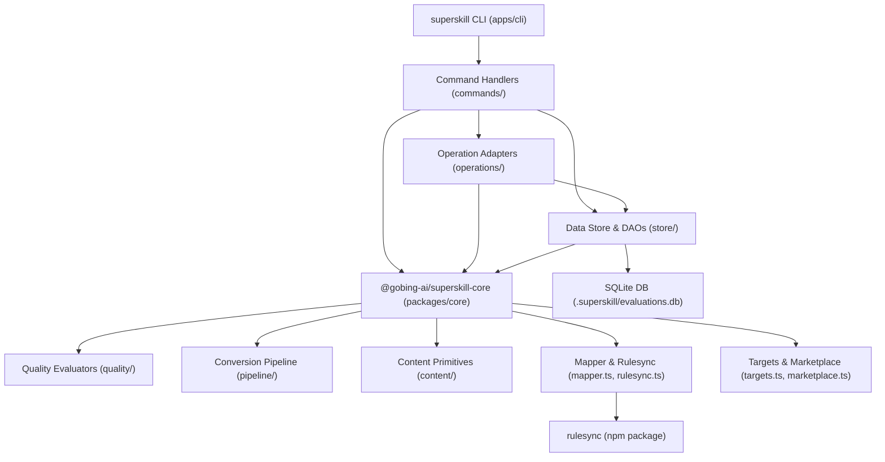
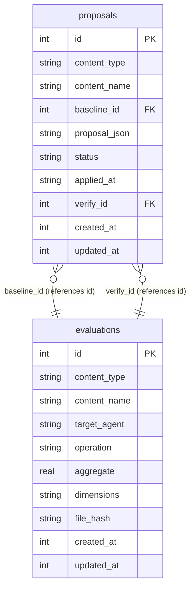
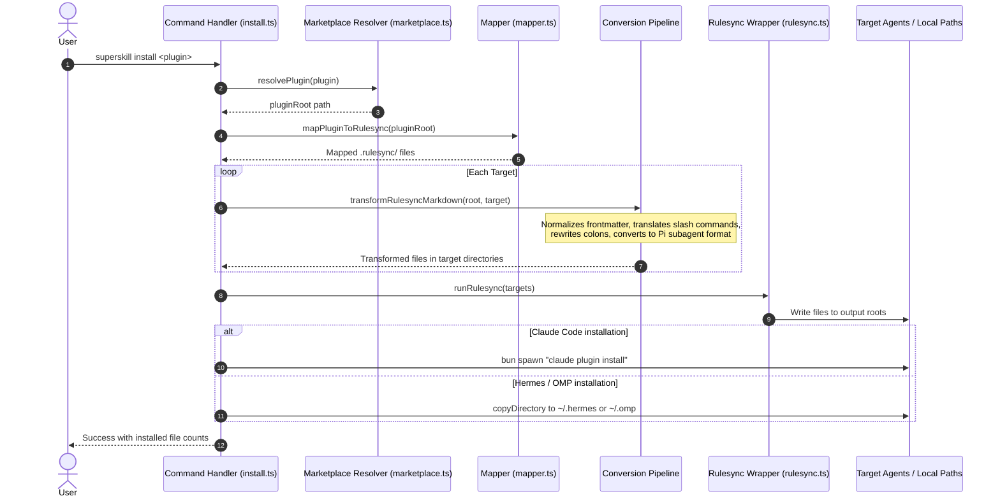
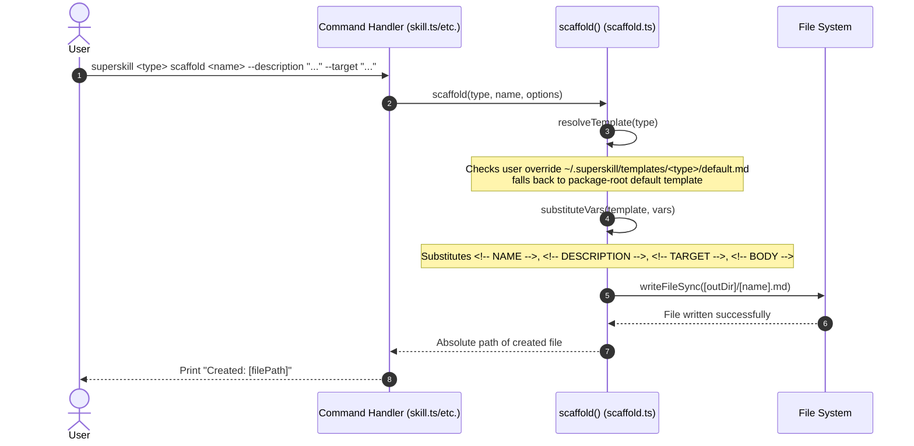
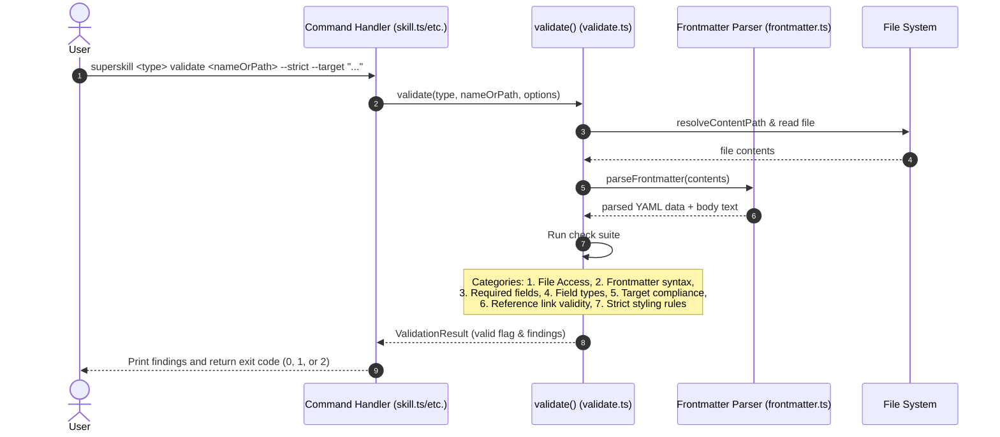
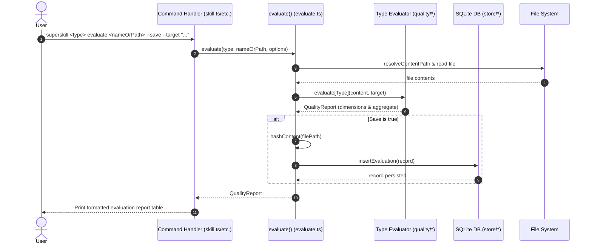
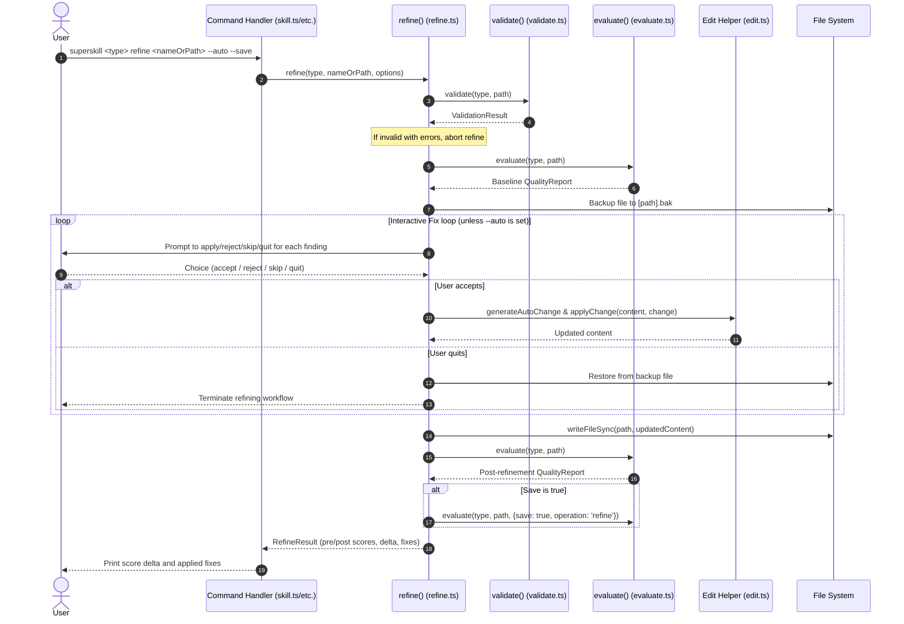
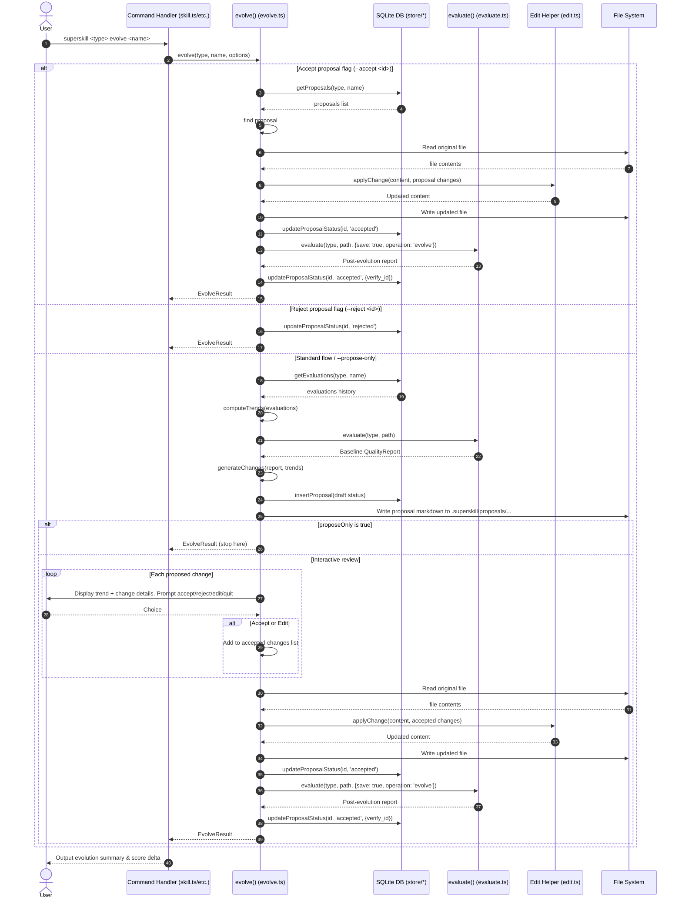

# Architecture

## Stack

| Layer | Choice | ADR |
|-------|--------|-----|
| Runtime | Bun 1.3 | 001 |
| Language | TypeScript 5.x | 001 |
| Lint / format | Biome | 001 |
| CLI framework | Commander.js | 003 |
| Test runner | bun:test | 001 |
| Format conversion | rulesync (npm) | 005 |
| Data store (Phase 2) | bun:sqlite (via @gobing-ai/ts-db) | 014 |

## High-Level Architecture

The superskill CLI is structured around clear separation between the CLI app (`apps/cli`) and reusable domain logic (`packages/core`). The CLI owns command handling, operation adapters, output formatting, and persistence; core owns content editing, quality scoring, conversion pipeline, target taxonomy, marketplace resolution, plugin mapping, and the rulesync wrapper. `apps/cli` imports `@gobing-ai/superskill-core`; core never depends on the app.



## Module boundaries

```
packages/core/src/                # ── Reusable domain logic (@gobing-ai/superskill-core) ──
├── content/                      # ── Common content-IO primitives ──
│   ├── backup.ts                 # .bak copy/restore helpers
│   ├── edit.ts                   # Apply structured text & frontmatter modifications
│   ├── frontmatter.ts            # Comment-preserving YAML frontmatter parser (ADR-012)
│   ├── hash.ts                   # Content hashing helper
│   ├── identity.ts               # Content name/path identity resolver (ADR-013)
│   ├── paths.ts                  # Data-root / DB / proposals path resolution
│   └── types.ts                  # ContentType canonical definition
│
├── quality/                      # ── Quality evaluation heuristics ──
│   ├── agent.ts                  # Subagent quality evaluation heuristics
│   ├── command.ts                # Slash command quality evaluation heuristics
│   ├── dimensions.ts             # Shared type-specific dimension registries
│   ├── hook.ts                   # Hook quality evaluation heuristics
│   ├── magent.ts                 # Main agent quality evaluation heuristics
│   ├── rubric.ts                 # Rubric loader & validator (ADR F022)
│   └── skill.ts                  # Skill quality evaluation heuristics
│
├── rubrics/                      # ── Built-in rubric YAML data ──
│   ├── agent.yaml
│   ├── command.yaml
│   ├── hook.yaml
│   ├── magent.yaml
│   └── skill.yaml
│
├── pipeline/                     # ── Conversion transformations (pure stages) ──
│   ├── convert.ts                # Transformation pipeline orchestration
│   ├── frontmatter.ts            # Frontmatter normalization stages
│   ├── pi-subagent.ts            # pi subagent conversion stage
│   ├── rewrite-colons.ts         # Rewrite colon syntax references
│   └── slash-command.ts          # Slash-dialect translation mappings
│
├── targets.ts                    # Target mapping registries and conversions
├── marketplace.ts                # Local plugin/marketplace manifest resolution (ADR-011)
├── mapper.ts                     # Mappings from plugin structure to rulesync canonical
├── rulesync.ts                   # Rulesync invocation wrapper (ADR-010)
└── index.ts                      # Public API barrel (structured results, typed errors; no process/stdout)

apps/cli/src/                     # ── CLI app (@gobing-ai/superskill) ──
├── commands/                     # ── Command CLI entry handlers ──
│   ├── agent.ts                  # superskill agent subcommands
│   ├── command.ts                # superskill command subcommands
│   ├── helpers.ts                # common options, target resolution, and operation runners
│   ├── hook.ts                   # superskill hook subcommands
│   ├── install.ts                # superskill install command
│   ├── magent.ts                 # superskill magent subcommands
│   └── skill.ts                  # superskill skill subcommands
│
├── operations/                   # ── Core platform operations (CLI adapters over core APIs) ──
│   ├── evaluate.ts               # Score content across dimensions and persist reports
│   ├── evolve.ts                 # Self-evolution loop using historical evaluations
│   ├── migrate.ts                # Cross-format migration operation
│   ├── package.ts                # Package content for distribution
│   ├── refine.ts                 # Evaluate-and-fix automation pipeline
│   ├── scaffold.ts               # Scaffolding content files from templates
│   └── validate.ts               # Syntax and layout verification engine
│
├── store/                        # ── Persistence database layer (app-owned; ADR-014) ──
│   ├── db.ts                     # Database connection initialization and migrations (re-exports getDBPath from core)
│   ├── evaluations.ts            # Append-only evaluations record DAO
│   ├── proposals.ts              # Evolution proposal lifecycle DAO
│   └── schema.ts                 # Database table schema definition
│
├── templates/                    # Scaffold templates (app-owned; consumed by scaffold operation)
├── config.ts                     # Configuration schema definition
├── hooks.ts                      # Hook emission (hermes/pi-style)
├── cli.ts                        # Program registration entrypoint
└── index.ts                      # Executable entrypoint
```

**Package boundary rules:** `apps/cli` imports `@gobing-ai/superskill-core`; `packages/core` never imports from `apps/cli`, never calls `process.exit`, and never writes to stdout/stderr. Cross-package access uses the `@gobing-ai/superskill-core` alias only — no deep relative imports across sibling packages. `store/` remains app-owned until a second consumer or independent library surface justifies extraction (deferred per task 0043 Phase 3).

### Workspace packages

- [apps/cli/](file:///Users/robin/xprojects/superskill/apps/cli): Commander CLI binary — command registration, option parsing, output formatting, exit-code mapping, operation adapters, and the persistence layer.
- [packages/core/](file:///Users/robin/xprojects/superskill/packages/core): Reusable domain logic — content editing, quality scoring, conversion pipeline, target taxonomy, marketplace resolution, plugin mapping, rulesync wrapper. Consumed by the CLI via `@gobing-ai/superskill-core`.
## Data flow

### Phase 1: Distribution

```
Plugin source                    Canonical              Target output
─────────────                    ─────────              ─────────────
plugins/<name>/                  .rulesync/             ~/.agents/skills/
  skills/*.md     ──mapper──►     skills/<name>-*/       ~/.pi/agent/agents/
  commands/*.md   ──mapper──►     commands/<name>-*.md   ~/.gemini/antigravity-cli/skills/
  agents/*.md     ──mapper──►     subagents/<name>-*.md  ~/.hermes/skills/
  hooks.json      ──mapper──►     hooks.json             ...
  mcp.json        ──mapper──►     mcp.json
                        │
                  ConversionPipeline (per-target, pure stages)
                        │
                  rulesync.generate({ outputRoots, global, ... })
                        │   writes <outputRoot>/<relativeDirPath> per rulesync
                        │
                  Copy step — hermes & omp only (not in rulesync)
```

`outputRoots = global ? [os.homedir()] : [process.cwd()]` (ADR-010). For every rulesync-supported target, the write is done by `generate()`; superskill copies only the two targets rulesync lacks (`hermes` and `omp`).

> [!IMPORTANT]
> **Invariant:** `.rulesync/` is the canonical intermediate representation. No feature module writes directly from plugin source to target output.

### Phase 2: Authoring + quality

```
User input                     Operations                   Data store
──────────                     ──────────                   ──────────
superskill skill scaffold      scaffold.ts ──► ./my-skill.md
superskill skill validate      validate.ts ──► findings JSON
superskill skill evaluate      evaluate.ts ──► scores ────► evaluations table
superskill skill refine        refine.ts   ──► fixed file + delta
superskill skill evolve        evolve.ts   ──► proposal ──► proposals table
                                         └──► applied changes ──► file updated
                                         └──► post-verify eval ──► evaluations table
```

> [!IMPORTANT]
> **Invariant:** The evolve loop is closed — every accepted proposal triggers a verification evaluation, creating a feedback trace in the data store.

## Database Schema & ER Diagram

The database runs on SQLite and is accessed through drizzle-orm using the `@gobing-ai/ts-db` wrapper. It contains two tables tracking evaluations and proposal lifecycles:



### Table Specifications

1. **`evaluations`** (DAO: [EvaluationDao](file:///Users/robin/xprojects/superskill/apps/cli/src/store/evaluations.ts)): Stores append-only metrics generated by evaluations, auto-refinements, or post-evolution verifications.
2. **`proposals`** (DAO: [ProposalDao](file:///Users/robin/xprojects/superskill/apps/cli/src/store/proposals.ts)): Manages the mutable lifecycle (`draft` → `accepted` | `rejected`) of self-evolution proposals.

## Source of truth

Claude Code plugin format (ADR-006):

```
plugins/<name>/
├── skills/<skill>.md        # YAML frontmatter + Markdown body
├── commands/<command>.md    # YAML frontmatter (argument-hint, allowed-tools)
├── agents/<agent>.md        # YAML frontmatter (tools, skill, model)
├── hooks.json               # Hook definitions
├── mcp.json                 # MCP server definitions
└── plugin.json              # Plugin manifest
```

## Plugin resolution

`superskill install <plugin>` locates the plugin root via a Claude Code marketplace manifest (ADR-011). Resolution order, first match wins:

1. `--marketplace <path>` — explicit path to a `.claude-plugin/marketplace.json` (or its containing dir).
2. `.claude-plugin/marketplace.json` in CWD.
3. Fallback: the `plugins/<name>/` directory scan (legacy convention).

**Manifest shape** (verified against Claude Code docs + `cc-agents/.claude-plugin/marketplace.json`):

```json
{
  "name": "cc-agents",
  "owner": { "name": "…", "email": "…" },
  "metadata": { "pluginRoot": "./plugins" },
  "plugins": [ { "name": "rd3", "source": "./plugins/rd3", "version": "…" } ]
}
```

> [!IMPORTANT]
> **Resolution rule (invariant 7):** match `<plugin>` against `plugins[].name`; the plugin root is `source` (prefixed by `metadata.pluginRoot` if `source` is bare) resolved relative to the **marketplace root** — the directory containing `.claude-plugin/`, *not* `.claude-plugin/` itself. Phase 1 accepts only **string relative-path** `source` values (must start `./`); object sources (`github`, `url`, `git-subdir`, `npm`) are rejected.

## Conversion rules

Carried from cc-agents/scripts. Pipeline stages are pure functions per invariant 5.

| Stage | Applies to | Effect |
|-------|-----------|--------|
| `rewriteColonRefs` | all prose | `plugin:command` → `plugin-command` |
| `translateSlashCommand` | commands | `/plugin:cmd` → per-agent dialect (delegates to `@gobing-ai/ts-ai-runner`); superskill `Target` is bridged to `AgentName` via `TARGET_TO_AGENT_NAME` (ADR-009 amendment) |
| `normalizeFrontmatter` | commands, subagents | Inject `name:`, normalize `allowed-tools:` |
| `convertToPiSubagent` | Pi subagents | Skills 2.0 → Pi native agent YAML |

`translateSlashCommand` accepts a ts-ai-runner `AgentName`, not a superskill `Target`; the two sets are disjoint on `antigravity-cli`/`antigravity-ide`/`hermes`/`omp`. `TARGET_TO_AGENT_NAME` (in [targets.ts](file:///Users/robin/xprojects/superskill/packages/core/src/targets.ts), consumed by [config.ts](file:///Users/robin/xprojects/superskill/apps/cli/src/config.ts)) bridges them: `omp→pi`, the antigravity/hermes targets fall to the function's `default` branch (`/plugin-command`).

## Target taxonomy

superskill maps each `Target` to a rulesync `ToolTarget` (`TARGET_TO_RULESYNC`) and to a ts-ai-runner `AgentName` for slash-dialect translation (`TARGET_TO_AGENT_NAME`, ADR-009 amendment). **superskill does not own per-target install paths** — rulesync resolves them from `<outputRoot>/<relativeDirPath>` (ADR-010). The global skill paths below are rulesync's resolved output *given* `outputRoot = ~`; they are documented for reference, not reimplemented in superskill.

| Target | rulesync target | AgentName (slash) | Global skill path (rulesync-resolved, `outputRoot=~`) | Note |
|--------|----------------|-------------------|-------------------------------------------------------|------|
| `claude` | — | `claude` | plugin marketplace | Not rulesync — direct `claude plugin install` |
| `codex` | `codexcli` | `codex` | `~/.agents/skills/` (under `$CODEX_HOME`) | |
| `pi` | `pi` | `pi` | `~/.pi/agent/skills/` | subagents → Pi native agent format |
| `omp` | — | `pi` | `~/.omp/agent/skills/` | Pi variant — copied by superskill, not rulesync |
| `opencode` | `opencode` | `opencode` | `~/.agents/skills/` | |
| `antigravity-cli` | `antigravity-cli` | default (`/plugin-command`) | `~/.gemini/antigravity-cli/skills/` | |
| `antigravity-ide` | `antigravity-ide` | default (`/plugin-command`) | `~/.gemini/config/skills/` | |
| `hermes` | — | default (`/plugin-command`) | `~/.hermes/skills/` | Custom — copied by superskill, not rulesync |

**Deprecated:** `gemini` (Gemini CLI), `antigravity` (old unified target).

**Output root (ADR-010).** rulesync writes to `<outputRoot>/<relativeDirPath>` and never resolves `~`. `runRulesync` sets `outputRoots: [os.homedir()]` for `--global`, `[process.cwd()]` otherwise; rulesync's `global` flag only swaps the relative subdir. The `hermes` and `omp` targets are absent from rulesync's `ToolTarget` set, so superskill copies their generated content to the paths above after `generate()`.

## CLI Commands Surface

The following represents all commands exposed by the `superskill` CLI:

```bash
# Distribution & Sync
superskill install <plugin> [--marketplace <path>] [--targets <list>] [--no-global] [--dry-run] [--verbose]

# Resource-specific Operations (type is one of: agent, skill, command, hook, magent)
superskill <type> scaffold <name> [--description <text>] [--target <agent>] [--output <dir>] [--force]
superskill <type> validate <nameOrPath> [--target <agent>] [--strict] [--json]
superskill <type> evaluate <nameOrPath> [--target <agent>] [--json] [--save]
superskill <type> refine <nameOrPath> [--target <agent>] [--auto] [--save]
superskill <type> evolve <name> [--target <agent>] [--from <date>] [--propose-only] [--accept <id>] [--reject <id>]
```

## Command Sequence Diagrams & Briefings

---

### 1. `superskill install <plugin>`

#### Briefing
Resolves the plugin root from the workspace directory or an optional marketplace manifest. Maps source files into canonical `.rulesync/` layouts, applies targeted markdown conversions (colon rewriting, slash-dialect translations, frontmatter normalizations, and Pi agent configurations), executes `rulesync` for supported target agents, and copy-dispatches output files for targets that rulesync does not support natively (e.g. Claude local installer, Hermes, and OMP).

#### Sequence Diagram



---

### 2. `superskill <type> scaffold <name>`

#### Briefing
Loads built-in or user-configured template markdown files (e.g., `~/.superskill/templates/<type>/default.md`), substitutes template variables (`<!-- NAME -->`, `<!-- DESCRIPTION -->`, `<!-- TARGET -->`, `<!-- BODY -->`), and writes the initial structured draft to disk. Overwriting existing files is disabled unless `--force` is provided.

#### Sequence Diagram



---

### 3. `superskill <type> validate <nameOrPath>`

#### Briefing
Performs multi-category syntax and configuration checks on a definition file. Parses the frontmatter safely to review required fields, data types, and target platform conventions (e.g., Pi singular `tool:` naming or Codex command naming). Verifies all internal reference links (`skill:`, `agent:`, `command:`) point to valid files on disk. Strict mode checks additional recommendations, such as character limits and deprecated fields.

#### Sequence Diagram



---

### 4. `superskill <type> evaluate <nameOrPath>`

#### Briefing
Analyzes resource quality across a type-specific registry of dimensions (e.g., completeness, clarity, trigger accuracy). Outputs a breakdown of scores (from 0.0 to 1.0) along with detailed notes suggesting areas of improvement, together with a consolidated aggregate score. If `--save` is active, it hashes the file content and records the results under the `.superskill/evaluations.db` database.

#### Sequence Diagram



---

### 5. `superskill <type> refine <nameOrPath>`

#### Briefing
Implements a validator-evaluator repair loop. Identifies issues via the validation engine and assigns fix strategies (`auto-apply`, `suggest`, or `flag`). Backs up the target file, applies low-risk syntax changes (e.g., correcting frontmatter array nesting or generating missing keys), prompts the user interactively to approve suggestions, and updates the file on disk. A post-verify evaluation is then triggered to calculate and display the quality score improvement delta.

#### Sequence Diagram



---

### 6. `superskill <type> evolve <name>`

#### Briefing
Executes the self-evolution lifecycle. Gathers the historical evaluations of a specific resource to analyze multi-run score trends. If any quality metrics are declining or remain flat below threshold levels, it compiles structural recommendations, writes a markdown proposal draft, and logs it under the proposals store. Through interactive review (or direct `--accept`/`--reject`), the changes are applied to the file, and a verification evaluation is run to ensure performance has improved.

#### Sequence Diagram



---

## Invariants

1. **Single plugin per install.** `superskill install <plugin>` installs exactly one plugin at a time.
2. **Idempotent output.** Running install twice with unchanged input produces identical output files.
3. **No silent data loss.** If a target path is unwritable, the command fails before touching any target.
4. **rulesync owns format knowledge.** superskill never hardcodes a target's file format — it delegates to `rulesync.generate()`.
5. **Pipeline stages are pure functions.** `(content: string, target: Target, options?: ConvertOptions) => string` — no side effects, no filesystem access.
6. **Closed evolve loop.** Every accepted evolution proposal triggers a verification evaluation — every change has a measured outcome.
7. **Marketplace-relative resolution.** A relative plugin `source` resolves against the marketplace root (the dir containing `.claude-plugin/`), never against `.claude-plugin/` or CWD. A `source` escaping the marketplace root (`../`) or using an object form is rejected, not silently resolved.
