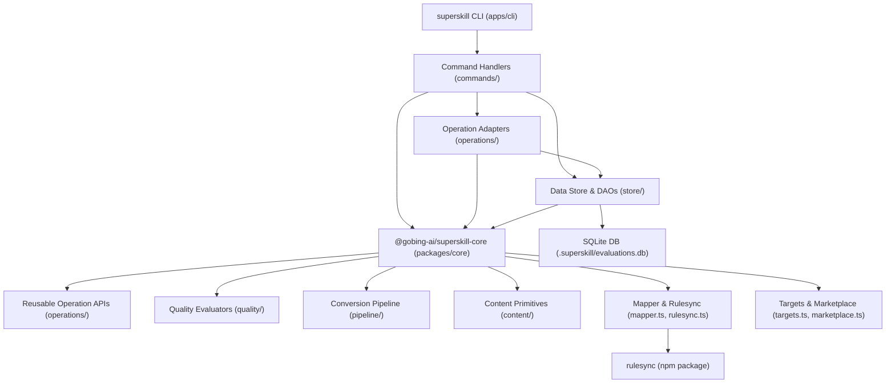
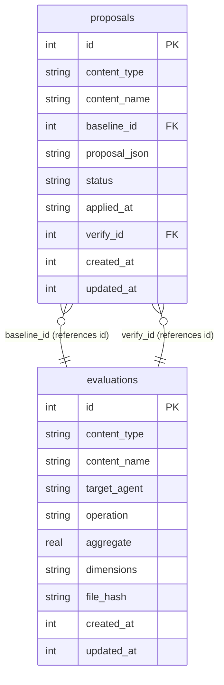
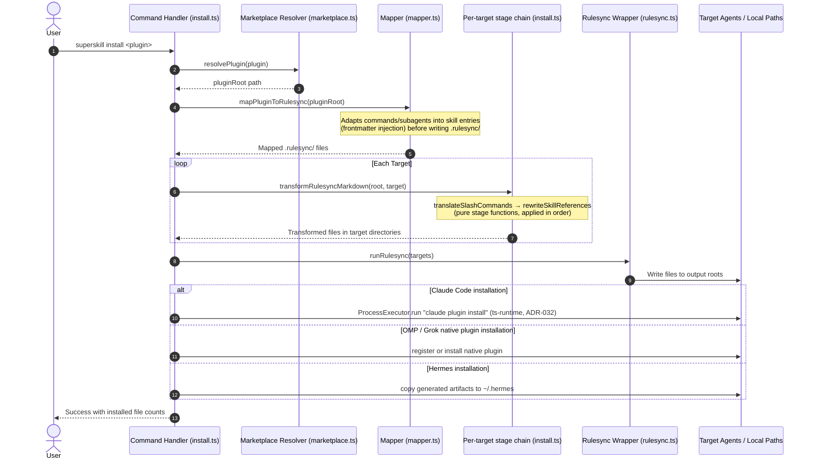
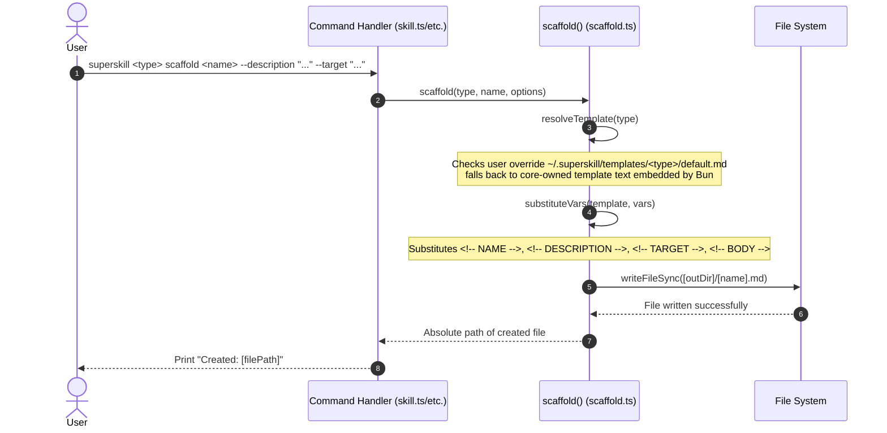
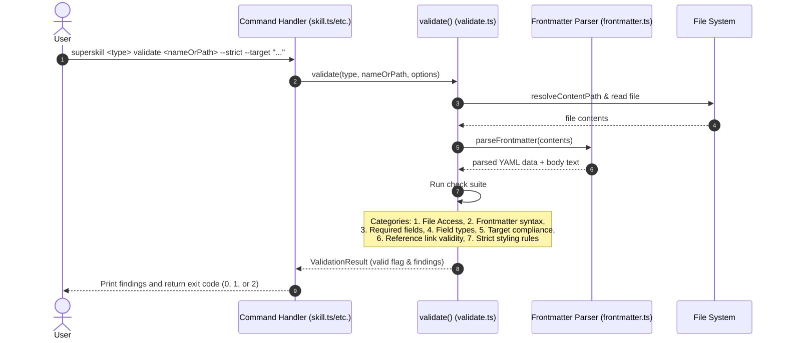
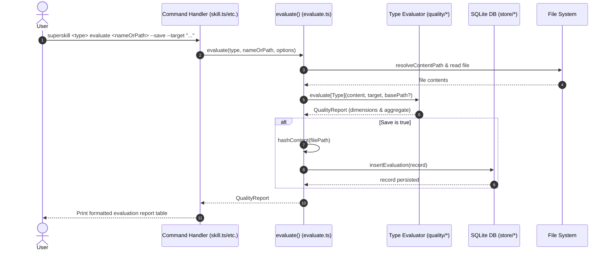
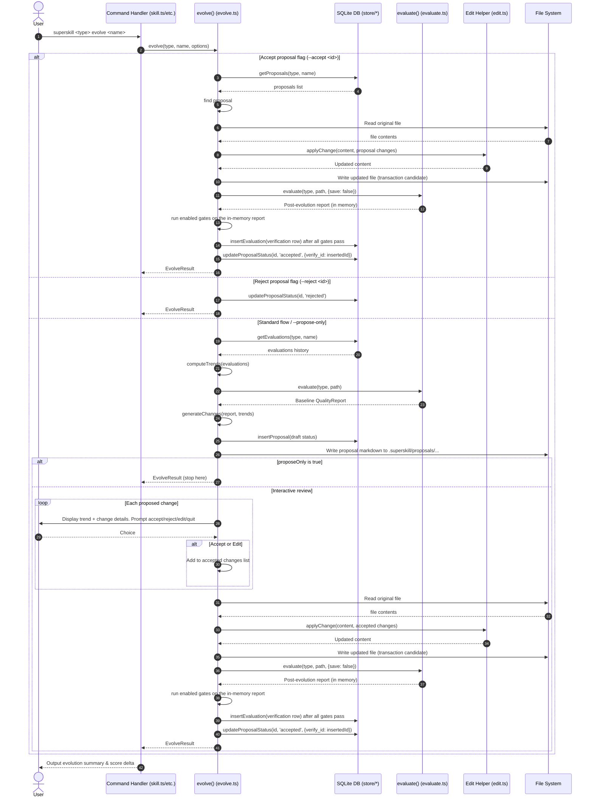

# Architecture

## Stack

| Layer | Choice | ADR |
|-------|--------|-----|
| Runtime | Bun 1.3 | 001 |
| Language | TypeScript 5.x | 001 |
| Lint / format | Biome | 001 |
| CLI framework | Commander.js | 003 |
| Test runner | bun:test | 001 |
| Format conversion | rulesync (npm) | 005 |
| Data store (Phase 2) | bun:sqlite (via @gobing-ai/ts-db) | 014 |

## High-Level Architecture

The superskill CLI is structured around clear separation between the CLI app (`apps/cli`) and reusable domain logic (`packages/core`). The CLI owns command handling, operation adapters, output formatting, persistence, and store-backed workflows; core owns content editing, quality scoring, conversion pipeline, target taxonomy, marketplace resolution, plugin mapping, the rulesync wrapper, and reusable operation APIs that have no app dependency. `apps/cli` imports `@gobing-ai/superskill-core`; core never depends on the app.


```mermaid
graph TD
    CLI["superskill CLI (apps/cli)"]
    CMDS["Command Handlers (commands/)"]
    OPS["Operation Adapters (operations/)"]
    STORE["Data Store & DAOs (store/)"]

    CORE["@gobing-ai/superskill-core (packages/core)"]
    CORE_OPS["Reusable Operation APIs (operations/)"]
    QUAL["Quality Evaluators (quality/)"]
    PIPE["Conversion Pipeline (pipeline/)"]
    CONTENT["Content Primitives (content/)"]
    MAPPER["Mapper & Rulesync (mapper.ts, rulesync.ts)"]
    TARGETS["Targets & Marketplace (targets.ts, marketplace.ts)"]

    CLI --> CMDS
    CMDS --> OPS
    CMDS --> STORE
    OPS --> STORE

    CMDS --> CORE
    OPS --> CORE
    STORE --> CORE
    CORE --> CORE_OPS
    CORE --> QUAL
    CORE --> PIPE
    CORE --> CONTENT
    CORE --> MAPPER
    CORE --> TARGETS
    MAPPER --> RS_PKG["rulesync (npm package)"]
    STORE --> SQLite["SQLite DB (.superskill/evaluations.db)"]
```

## Module boundaries

```
packages/core/src/                # ── Reusable domain logic (@gobing-ai/superskill-core) ──
├── content/                      # ── Common content-IO primitives ──
│   ├── backup.ts                 # .bak copy/restore helpers
│   ├── edit.ts                   # Apply structured text & frontmatter modifications
│   ├── frontmatter.ts            # Comment-preserving YAML frontmatter parser (ADR-012)
│   ├── hash.ts                   # Content hashing helper
│   ├── hook-events.ts            # Claude hook-event taxonomy + canonical mapping
│   ├── identity.ts               # Content name/path identity resolver (ADR-013)
│   ├── paths.ts                  # Data-root / DB / proposals path resolution
│   └── types.ts                  # ContentType canonical definition
│
├── quality/                      # ── Quality evaluation heuristics ──
│   ├── agent.ts                  # Subagent quality evaluation heuristics
│   ├── command.ts                # Slash command quality evaluation heuristics
│   ├── eval-cases.ts             # Behavior-evaluation case loading and validation
│   ├── evaluate.ts               # Shared quality-report composition
│   ├── heuristics.ts             # Cross-type scoring helpers
│   ├── hook.ts                   # Hook quality evaluation heuristics
│   ├── magent.ts                 # Main agent quality evaluation heuristics (harness-aware scoring signals via template + cc-magents)
│   ├── replay.ts                 # Deterministic behavior replay primitives
│   ├── rubric.ts                 # Rubric loader & validator (feature G32)
│   ├── skill.ts                  # Skill quality evaluation heuristics
│   └── types.ts                  # Quality report and rubric types
│
├── rubrics/                      # ── Built-in rubric YAML data ──
│   ├── agent.yaml
│   ├── command.yaml
│   ├── hook.yaml
│   ├── magent.yaml
│   └── skill.yaml
│
├── templates/                    # ── Built-in scaffold templates, bundled as text imports ──
│   ├── agent/                    # Default/minimal/specialist/standard subagent templates
│   ├── command/                  # Default/plugin/simple/workflow command templates
│   ├── magent/                   # Harness-aware main-agent template
│   └── skill/                    # Default/pattern/reference/technique skill templates
│
├── pipeline/                     # ── Conversion transformations (pure stage functions) ──
│   ├── adapt-command.ts          # Adapt Claude command .md → Skills 2.0 skill entry
│   ├── adapt-subagent.ts         # Adapt Claude subagent .md -> skill entry / Pi native agent / Codex native agent TOML
│   ├── frontmatter-walk.ts       # Shared frontmatter-block walker for the adapt-* stages
│   ├── marketplace-registration.ts # Native marketplace registration adapters
│   ├── pi-tools.ts               # Claude → Pi tool-name normalization + skill-ref extraction
│   ├── rewrite-references.ts     # Rewrite scoped plugin:name colon references
│   ├── select-magent.ts          # Main-agent config selection and target placement
│   ├── slash-command.ts          # Slash-dialect translation mappings
│   └── yaml-utils.ts             # YAML transform helpers
│
├── operations/                   # ── Reusable operation APIs with no app dependency ──
│   ├── install-manifest.ts       # Install provenance DTO, path, snapshot, atomic write (ADR-035)
│   ├── migrate.ts                # Deterministic skill merge/migration core
│   ├── package.ts                # Package content for distribution
│   ├── scaffold.ts               # Scaffold content files from templates
│   ├── update.ts                 # Pure marketplace/bundled comparison + aggregate exit (ADR-035)
│   └── validate.ts               # Syntax and layout verification engine
│
├── skills-ecosystem/             # Loose SKILL.md discovery, fetch, install, emit, and lock interop
│   ├── fetch.ts                  # Hardened local/GitHub source acquisition
│   ├── installer.ts              # Canonical install and per-target emission
│   ├── locks.ts                  # Project/global skills lock interop
│   ├── operations.ts             # Add/list/remove/update domain operations
│   └── source-parser.ts          # Local path, URL, and GitHub shorthand parsing
│
├── targets.ts                    # Target mapping registries and conversions
├── marketplace.ts                # Marketplace manifest resolution + locator probe (ADR-011, ADR-034)
├── mapper.ts                     # Mappings from plugin structure to rulesync canonical
├── rulesync.ts                   # Rulesync invocation wrapper (ADR-010)
└── index.ts                      # Public API barrel (structured results, typed errors; no process/stdout)

apps/cli/src/                     # ── CLI app (@gobing-ai/superskill) ──
├── commands/                     # ── Command CLI entry handlers ──
│   ├── agent.ts                  # superskill agent subcommands
│   ├── command.ts                # superskill command subcommands
│   ├── helpers.ts                # common options, target resolution, and operation runners
│   ├── hook-run.ts               # registered plugin hook runtime dispatcher
│   ├── hook.ts                   # superskill hook subcommands
│   ├── install.ts                # superskill install command
│   ├── magent.ts                 # superskill magent subcommands
│   ├── script-convert.ts         # portable .mjs build command
│   ├── script-path.ts            # staged plugin entrypoint resolver
│   ├── script-run.ts             # registered plugin script dispatcher
│   ├── skill.ts                  # superskill skill subcommands
│   └── update.ts                 # superskill update check / re-install (ADR-035)
│
├── operations/                   # ── CLI adapters and store-backed workflows ──
│   ├── evaluate.ts               # App-owned scoring workflow: CLI envelope output + store persistence
│   ├── evolve.ts                 # Self-evolution loop using historical evaluations
│   ├── migrate.ts                # CLI migration adapter; delegates deterministic merge to core
│   ├── noise-floor.ts            # Pairwise-judge noise-floor calibration
│   ├── package.ts                # Thin re-export adapter over core package API
│   ├── pairwise-judge.ts         # Candidate-vs-baseline judgment adapter
│   ├── refine.ts                 # Evaluate-and-fix automation pipeline
│   ├── replay-runner.ts          # Held-out behavior replay orchestration
│   ├── scaffold.ts               # Thin re-export adapter over core scaffold API
│   └── validate.ts               # Thin re-export adapter over core validate API
│
├── store/                        # ── Persistence database layer (app-owned; ADR-014) ──
│   ├── db.ts                     # Database connection initialization and migrations (re-exports getDBPath from core)
│   ├── evaluations.ts            # Append-only evaluations record DAO
│   ├── proposals.ts              # Evolution proposal lifecycle DAO
│   └── schema.ts                 # Database table schema definition
│
├── config.ts                     # Configuration schema definition
├── hooks.ts                      # Hook emission (hermes/pi-style)
├── omp-hooks.ts                  # OMP hook-module reconciliation
├── stdin.ts                      # Non-blocking bounded stdin payload reader
├── cli.ts                        # Program registration entrypoint
└── index.ts                      # Executable entrypoint
```

**Package boundary rules:** `apps/cli` imports `@gobing-ai/superskill-core`; `packages/core` never imports from `apps/cli`, never calls `process.exit`, and never writes to stdout/stderr. Cross-package access uses the `@gobing-ai/superskill-core` alias only — no deep relative imports across sibling packages. `store/` remains app-owned because persisted evaluations/proposals still have no second consumer and require the CLI-local data-root/store seam.

### Workspace packages

- [apps/cli/](../apps/cli/): Commander CLI binary — command registration, option parsing, output formatting, exit-code mapping, operation adapters, and the persistence layer.
- [packages/core/](../packages/core/): Reusable domain logic — content editing, quality scoring, conversion pipeline, target taxonomy, marketplace resolution, plugin mapping, rulesync wrapper, and no-app operation APIs. Consumed by the CLI via `@gobing-ai/superskill-core`.
## Data flow

### Phase 1: Distribution

```
CLI flags + superskill.jsonc
          │
          ▼
Plugin source                    Canonical              Target output
─────────────                    ─────────              ─────────────
plugins/<name>/                  .rulesync/             ~/.agents/skills/
  skills/*.md     ──mapper──►     skills/<name>-*/       ~/.pi/agent/agents/
  commands/*.md   ──mapper──►     commands/<name>-*.md   ~/.gemini/antigravity-cli/skills/
  agents/*.md     ──mapper──►     subagents/<name>-*.md  ~/.hermes/skills/
  hooks.json      ──mapper──►     hooks.json             ...
  mcp.json        ──mapper──►     mcp.json
                        │
                  Per-target stage chain (pure functions, applied in order):
                  translateSlashCommands ─► rewriteSkillReferences
                  (frontmatter adaptation already applied by the mapper)
                        │
                  rulesync.generate({ outputRoots, global, ... })
                        │   writes <outputRoot>/<relativeDirPath> per rulesync
                        │
                  Native host dispatch (Claude / OMP / Grok) or Hermes copy fallback
```

`outputRoots = global ? [os.homedir()] : [process.cwd()]` (ADR-010). For rulesync-supported targets, writes are done by `generate()`. Claude, OMP, and Grok use their native host-plugin installers; Hermes receives the explicit copy fallback. OMP skills also read the shared `.agents/skills/` output natively.

The install action loads `superskill.jsonc` before resolving the plugin. Explicit
`--marketplace`/`--targets` values win over configured defaults; a configured plugin path is used
before ambient marketplace discovery when `--marketplace` is absent. The configured `features`
filter is applied by the mapper, so excluded artifact classes never enter `.rulesync/`. Native
targets whose installers cannot honor a partial feature set fail before mutation instead of
silently installing the full plugin.

> [!IMPORTANT]
> **Invariant:** `.rulesync/` is the canonical intermediate representation. No feature module writes directly from plugin source to target output. Each install invocation owns a unique temporary parent (OS tempdir) containing its own `.rulesync/` — never the working directory's `.rulesync/` — so concurrent installs cannot read, transform, or emit from each other's staging. The tree is removed in a `finally` block after success and after a thrown dependency/dispatch error; the canonical intermediate is internal and never left refreshed on disk. Dry-run suppresses target writes while still mapping through isolated staging.

### Phase 2: Authoring + quality

```
User input                     Operations                   Data store
──────────                     ──────────                   ──────────
superskill skill scaffold      scaffold.ts ──► ./my-skill.md
superskill skill validate      validate.ts ──► findings JSON
superskill skill evaluate      evaluate.ts ──► scores ────► evaluations table
superskill skill refine        refine.ts   ──► fixed file + delta
superskill skill evolve        evolve.ts   ──► proposal ──► proposals table
                                         └──► applied changes ──► file updated
                                         └──► post-verify eval ──► evaluations table
```

> [!IMPORTANT]
> **Invariant:** The evolve loop is closed — every accepted proposal triggers a verification evaluation, creating a feedback trace in the data store.

## Database Schema & ER Diagram

The database runs on SQLite and is accessed through drizzle-orm using the `@gobing-ai/ts-db` wrapper. It contains two tables tracking evaluations and proposal lifecycles:


```mermaid
erDiagram
    evaluations {
        int id PK
        string content_type
        string content_name
        string target_agent
        string operation
        real aggregate
        string dimensions
        string file_hash
        int created_at
        int updated_at
    }
    proposals {
        int id PK
        string content_type
        string content_name
        int baseline_id FK
        string proposal_json
        string status
        string applied_at
        int verify_id FK
        int created_at
        int updated_at
    }
    proposals }o--|| evaluations : "baseline_id (references id)"
    proposals }o--|| evaluations : "verify_id (references id)"
```

### Table Specifications

1. **`evaluations`** (DAO: [EvaluationDao](../apps/cli/src/store/evaluations.ts)): Stores append-only metrics generated by evaluations, auto-refinements, or post-evolution verifications.
2. **`proposals`** (DAO: [ProposalDao](../apps/cli/src/store/proposals.ts)): Manages the mutable lifecycle (`draft` → `accepted` | `rejected`) of self-evolution proposals.

## Source of truth

Claude Code plugin format (ADR-006):

```
plugins/<name>/
├── skills/<skill>.md        # YAML frontmatter + Markdown body
├── commands/<command>.md    # YAML frontmatter (argument-hint, allowed-tools)
├── agents/<agent>.md        # YAML frontmatter (tools, skill, model)
├── hooks.json               # Hook definitions
├── mcp.json                 # MCP server definitions
└── plugin.json              # Plugin manifest
```

## Plugin resolution

`superskill install <plugin>` resolves the plugin root from explicit CLI input, validated config, or
a Claude Code marketplace manifest (ADR-011, extended by ADR-034). Resolution order, first match wins:

1. `--marketplace <locator>` — a **marketplace locator** (ADR-034): local path
   (probed direct-file → `<X>/marketplace.json` → `<X>/.claude-plugin/marketplace.json`),
   GitHub URL, or `owner/repo` shorthand. Remote locators are materialized into
   `~/.cache/superskill/marketplaces/<owner>/<repo>/<ref>/` first; the cache root feeds the
   unchanged local resolve flow.
2. Matching `plugins[].path` in project-local `superskill.jsonc`.
3. `.claude-plugin/marketplace.json` in CWD.
4. **Installed package root** self-location (ADR-034): probe the CLI's own bundled
   `.claude-plugin/marketplace.json` then `plugins/<name>`, so a registry install works from any
   CWD. Falls through silently for `--compile` binaries (virtual `/$bunfs/root`) and dev-repo runs.
5. Fallback: the `plugins/<name>/` directory scan (legacy convention).

`marketplaceRoot` is derived **per matched probe branch** (`dirname(manifest)`, raised one level
only when that dirname is `.claude-plugin`) — the root-level `<X>/marketplace.json` branch resolves
under `<X>`, not its parent (ADR-034).

**Manifest shape** (verified against Claude Code docs + `cc-agents/.claude-plugin/marketplace.json`):

```json
{
  "name": "cc-agents",
  "owner": { "name": "…", "email": "…" },
  "metadata": { "pluginRoot": "./plugins" },
  "plugins": [ { "name": "rd3", "source": "./plugins/rd3", "version": "…" } ]
}
```

> [!IMPORTANT]
> **Resolution rule (invariant 7):** match `<plugin>` against `plugins[].name`; the plugin root is `source` (prefixed by `metadata.pluginRoot` if `source` is bare) resolved relative to the **marketplace root** — derived per probe branch as `dirname(manifest)`, raised one level only when that dirname is `.claude-plugin` (ADR-034). Only **string relative-path** `source` values are accepted (must start `./`); object sources (`github`, `url`, `git-subdir`, `npm`) are rejected — remote marketplaces are reached via `--marketplace <locator>`, never via in-manifest object `source`.

## Conversion rules

Carried from cc-agents/scripts. Pipeline stages are pure functions per invariant 5.

| Stage | Applies to | Effect |
|-------|-----------|--------|
| `rewriteColonRefs` | all prose | `plugin:command` → `plugin-command` |
| `translateSlashCommand` | commands | `/plugin:cmd` → per-agent dialect (delegates to `@gobing-ai/ts-ai-runner`); superskill `Target` is bridged to `AgentName` via `TARGET_TO_AGENT_NAME` (ADR-009 amendment) |
| `normalizeFrontmatter` | commands, subagents | Inject `name:`, normalize `allowed-tools:` |
| `adaptSubagentToPi` | Pi subagents | Skills 2.0 → Pi native agent YAML (skill refs filtered to existing skills) |
| `adaptSubagentToCodex` | Codex subagents | Skills 2.0 -> Codex native agent TOML (model-tier -> model/model_reasoning_effort via `CODEX_MODEL_TIERS`, skill refs rewritten, pinned key order) |

`translateSlashCommand` accepts a ts-ai-runner `AgentName`, not a superskill `Target`. `TARGET_TO_AGENT_NAME` (in [targets.ts](../packages/core/src/targets.ts), consumed by [config.ts](../apps/cli/src/config.ts)) maps Claude, Codex, Pi, OMP, OpenCode, antigravity-cli, Hermes, and Grok 1:1; only `antigravity-ide` bridges to `opencode`. Grok's native-plugin path bypasses slash translation because its command dialect remains Claude-compatible.

## Target taxonomy

superskill maps each `Target` to a rulesync `ToolTarget` (`TARGET_TO_RULESYNC`) and to a ts-ai-runner `AgentName` for slash-dialect translation (`TARGET_TO_AGENT_NAME`, ADR-009 amendment). **superskill does not own per-target install paths** — rulesync resolves them from `<outputRoot>/<relativeDirPath>` (ADR-010). The global skill paths below are rulesync's resolved output *given* `outputRoot = ~`; they are documented for reference, not reimplemented in superskill.

| Target | rulesync target | AgentName (slash) | Global skill path | Note |
|--------|----------------|-------------------|------------------|------|
| `claude` | — | `claude` | native plugin cache | Native host-plugin install |
| `codex` | `codexcli` | `codex` | `~/.agents/skills/` | Dual-emit - subagents -> Codex native agent TOML at `~/.codex/agents/` (ADR-033) |
| `pi` | `codexcli` | `pi` | `~/.agents/skills/` | Unified — subagents → Pi native agent format |
| `omp` | — | `omp` | `~/.agents/skills/` | Native plugin install; reads shared skills output |
| `opencode` | `opencode` | `opencode` | `~/.config/opencode/skills/` | |
| `antigravity-cli` | `antigravity-cli` | `antigravity-cli` | `~/.gemini/antigravity-cli/skills/` | Native — agy reads this dir |
| `antigravity-ide` | `antigravity-ide` | `opencode` | `~/.gemini/config/skills/` | Native — IDE reads this dir |
| `hermes` | — | `hermes` | `~/.hermes/skills/` | Copied by superskill |
| `grok` | — | `grok` | native plugin cache | Native host-plugin install; slash conversion bypassed |

**Output root (ADR-010).** rulesync writes to `<outputRoot>/<relativeDirPath>` and never resolves `~`. `runRulesync` sets `outputRoots: [os.homedir()]` for `--global`, `[process.cwd()]` otherwise; rulesync's `global` flag only swaps the relative subdir. Claude, OMP, Hermes, and Grok have no `ToolTarget` mapping: Claude/OMP/Grok use native host-plugin dispatch, Hermes copies opencode-generated skills to `~/.hermes/skills/`, and OMP also reads the shared `~/.agents/skills/` output natively (ADR-010 amendment 2026-06-23).

## CLI routing

Commander registers seven root families. Exact signatures and flags are transcribed in [04_DESIGN.md](04_DESIGN.md).

| Family | Registered subcommands |
|--------|------------------------|
| `install` | root command |
| `agent` | `scaffold`, `validate`, `evaluate`, `refine`, `evolve` |
| `skill` | `add`, `list`, `remove`/`rm`, `update`, `scaffold`, `validate`, `evaluate`, `refine`, `evolve`, `package`, `migrate` |
| `command` | `scaffold`, `validate`, `evaluate`, `refine`, `evolve` |
| `hook` | `validate`, `evaluate`, `refine`, `evolve`, `emit`, `run` |
| `magent` | `scaffold`, `validate`, `evaluate`, `refine`, `evolve` |
| `script` | `run`, `path`, `convert` |

## Command Sequence Diagrams & Briefings

---

### 1. `superskill install <plugin>`

#### Briefing
Resolves the plugin root from the workspace directory or an optional marketplace locator. Maps source files into canonical `.rulesync/` layouts, applies targeted markdown conversions, executes `rulesync` for supported target agents, invokes native host-plugin installers for Claude/OMP/Grok, and copy-dispatches the Hermes fallback.

#### Sequence Diagram


```mermaid
sequenceDiagram
    autonumber
    actor User
    participant CLI as Command Handler (install.ts)
    participant Marketplace as Marketplace Resolver (marketplace.ts)
    participant Mapper as Mapper (mapper.ts)
    participant Pipe as Per-target stage chain (install.ts)
    participant Rulesync as Rulesync Wrapper (rulesync.ts)
    participant Upstream as Target Agents / Local Paths

    User->>CLI: superskill install <plugin>
    CLI->>Marketplace: resolvePlugin(plugin)
    Marketplace-->>CLI: pluginRoot path
    CLI->>Mapper: mapPluginToRulesync(pluginRoot)
    Note over Mapper: Adapts commands/subagents into skill entries<br/>(frontmatter injection) before writing .rulesync/
    Mapper-->>CLI: Mapped .rulesync/ files
    loop Each Target
        CLI->>Pipe: transformRulesyncMarkdown(root, target)
        Note over Pipe: translateSlashCommands → rewriteSkillReferences<br/>(pure stage functions, applied in order)
        Pipe-->>CLI: Transformed files in target directories
    end
    CLI->>Rulesync: runRulesync(targets)
    Rulesync->>Upstream: Write files to output roots
    alt Claude Code installation
        CLI->>Upstream: ProcessExecutor.run "claude plugin install" (ts-runtime, ADR-032)
    else OMP / Grok native plugin installation
        CLI->>Upstream: register or install native plugin
    else Hermes installation
        CLI->>Upstream: copy generated artifacts to ~/.hermes
    end
    CLI-->>User: Success with installed file counts
```

---

### 2. `superskill <type> scaffold <name>`

#### Briefing
Loads built-in templates embedded from `packages/core/src/templates/` or user overrides from `~/.superskill/templates/<type>/`, substitutes template variables (`<!-- NAME -->`, `<!-- DESCRIPTION -->`, `<!-- TARGET -->`, `<!-- BODY -->`), and writes the initial structured draft to disk. Overwriting existing files is disabled unless `--force` is provided.

#### Sequence Diagram


```mermaid
sequenceDiagram
    autonumber
    actor User
    participant CLI as Command Handler (skill.ts/etc.)
    participant Scaffold as scaffold() (scaffold.ts)
    participant FS as File System

    User->>CLI: superskill <type> scaffold <name> --description "..." --target "..."
    CLI->>Scaffold: scaffold(type, name, options)
    Scaffold->>Scaffold: resolveTemplate(type)
    Note over Scaffold: Checks user override ~/.superskill/templates/<type>/default.md<br/>falls back to core-owned template text embedded by Bun
    Scaffold->>Scaffold: substituteVars(template, vars)
    Note over Scaffold: Substitutes <!-- NAME -->, <!-- DESCRIPTION -->, <!-- TARGET -->, <!-- BODY -->
    Scaffold->>FS: writeFileSync([outDir]/[name].md)
    FS-->>Scaffold: File written successfully
    Scaffold-->>CLI: Absolute path of created file
    CLI-->>User: Print "Created: [filePath]"
```

---

### 3. `superskill <type> validate <nameOrPath>`

#### Briefing
Performs multi-category syntax and configuration checks on a definition file. Parses the frontmatter safely to review required fields, data types, and target platform conventions (e.g., Pi singular `tool:` naming or Codex command naming). Verifies all internal reference links (`skill:`, `agent:`, `command:`) point to valid files on disk. Strict mode checks additional recommendations, such as character limits and deprecated fields.

#### Sequence Diagram


```mermaid
sequenceDiagram
    autonumber
    actor User
    participant CLI as Command Handler (skill.ts/etc.)
    participant Validate as validate() (validate.ts)
    participant Frontmatter as Frontmatter Parser (frontmatter.ts)
    participant FS as File System

    User->>CLI: superskill <type> validate <nameOrPath> --strict --target "..."
    CLI->>Validate: validate(type, nameOrPath, options)
    Validate->>FS: resolveContentPath & read file
    FS-->>Validate: file contents
    Validate->>Frontmatter: parseFrontmatter(contents)
    Frontmatter-->>Validate: parsed YAML data + body text
    Validate->>Validate: Run check suite
    Note over Validate: Categories: 1. File Access, 2. Frontmatter syntax,<br/>3. Required fields, 4. Field types, 5. Target compliance,<br/>6. Reference link validity, 7. Strict styling rules
    Validate-->>CLI: ValidationResult (valid flag & findings)
    CLI-->>User: Print findings and return exit code (0, 1, or 2)
```

---

### 4. `superskill <type> evaluate <nameOrPath>`

#### Briefing
Analyzes resource quality across a type-specific registry of dimensions (e.g., completeness, clarity, trigger accuracy). Outputs a breakdown of scores (from 0.0 to 1.0) along with detailed notes suggesting areas of improvement, together with a consolidated aggregate score. If `--save` is active, it hashes the file content and records the results under the `.superskill/evaluations.db` database.

Evaluators take an optional `basePath`. It is the directory that relative markdown links in the evaluated content resolve against, which lets a dimension credit a governance area satisfied by a link to a file that exists on disk rather than only by an inline section — the disclosure-aware path in `magent`'s `completeness`. A link whose target does not resolve earns nothing, so the same mechanism detects stale links. At the core API level omitting `basePath` disables link resolution (`resolvesOnDisk` returns false) and leaves scores byte-identical to the pre-`basePath` behavior; only `magent`'s evaluator consumes it. The CLI operation (`apps/cli/src/operations/evaluate.ts`) always supplies one, defaulting to the evaluated file's own directory (`dirname(resolvedPath)`) — a plain `superskill <type> evaluate <file>` therefore resolves links. `magent evaluate` exposes the override as `--base-path <dir>` for content authored to live elsewhere (e.g. a scaffold template scored as if already at a project root). Defaulting on is safe because link credit is additive: `scoreCompleteness` short-circuits on a heading match and only *adds* on a link match, so no re-evaluation can regress a stored score.

#### Sequence Diagram


```mermaid
sequenceDiagram
    autonumber
    actor User
    participant CLI as Command Handler (skill.ts/etc.)
    participant Evaluate as evaluate() (evaluate.ts)
    participant Evaluator as Type Evaluator (quality/*)
    participant DB as SQLite DB (store/*)
    participant FS as File System

    User->>CLI: superskill <type> evaluate <nameOrPath> --save --target "..."
    CLI->>Evaluate: evaluate(type, nameOrPath, options)
    Evaluate->>FS: resolveContentPath & read file
    FS-->>Evaluate: file contents
    Evaluate->>Evaluator: evaluate[Type](content, target, basePath?)
    Evaluator-->>Evaluate: QualityReport (dimensions & aggregate)
    alt Save is true
        Evaluate->>Evaluate: hashContent(filePath)
        Evaluate->>DB: insertEvaluation(record)
        DB-->>Evaluate: record persisted
    end
    Evaluate-->>CLI: QualityReport
    CLI-->>User: Print formatted evaluation report table
```

---

### 5. `superskill <type> refine <nameOrPath>`

#### Briefing
Implements a validator-evaluator repair loop. Identifies issues via the validation engine and assigns fix strategies (`auto-apply`, `suggest`, or `flag`). Backs up the target file, applies low-risk syntax changes (e.g., correcting frontmatter array nesting or generating missing keys), prompts the user interactively to approve suggestions, and updates the file on disk. A post-verify evaluation is then triggered to calculate and display the quality score improvement delta.

#### Sequence Diagram

```mermaid
sequenceDiagram
    autonumber
    actor User
    participant CLI as Command Handler (skill.ts/etc.)
    participant Refine as refine() (refine.ts)
    participant Validate as validate() (validate.ts)
    participant Evaluate as evaluate() (evaluate.ts)
    participant Edit as Edit Helper (edit.ts)
    participant FS as File System

    User->>CLI: superskill <type> refine <nameOrPath> --auto --save
    CLI->>Refine: refine(type, nameOrPath, options)
    Refine->>Validate: validate(type, path)
    Validate-->>Refine: ValidationResult
    Note over Refine: Classify validation findings; structural auto-fixes remain reachable
    Refine->>Evaluate: evaluate(type, path)
    Evaluate-->>Refine: Baseline QualityReport
    Refine->>FS: Backup file to [path].bak
    loop Interactive Fix loop (unless --auto is set)
        Refine->>User: Prompt to apply/reject/skip/quit for each finding
        User-->>Refine: Choice (accept / reject / skip / quit)
        alt User accepts
            Refine->>Edit: generateAutoChange & applyChange(content, change)
            Edit-->>Refine: Updated content
        else User quits
            Refine->>FS: Restore from backup file
            Refine-->>User: Terminate refining workflow
        end
    end
    Refine->>FS: writeFileSync(path, updatedContent)
    alt Initial validation had errors
        Refine->>Validate: revalidate(type, path)
        alt Errors remain
            Refine->>FS: Restore from backup and abort
        end
    end
    Refine->>Evaluate: evaluate(type, path)
    Evaluate-->>Refine: Post-refinement QualityReport
    alt Save is true
        Refine->>Evaluate: evaluate(type, path, {save: true, operation: 'refine'})
    end
    Refine-->>CLI: RefineResult (pre/post scores, delta, fixes)
    CLI-->>User: Print score delta and applied fixes
```

---

### 6. `superskill <type> evolve <name>`

#### Briefing
Executes the self-evolution lifecycle. Gathers the historical evaluations of a specific resource to analyze multi-run score trends. If any quality metrics are declining or remain flat below threshold levels, it compiles structural recommendations, writes a markdown proposal draft, and logs it under the proposals store. Through interactive review (or direct `--accept`/`--reject`), the changes are applied to the file, and a verification evaluation is run to ensure performance has improved.

#### Sequence Diagram


```mermaid
sequenceDiagram
    autonumber
    actor User
    participant CLI as Command Handler (skill.ts/etc.)
    participant Evolve as evolve() (evolve.ts)
    participant DB as SQLite DB (store/*)
    participant Evaluate as evaluate() (evaluate.ts)
    participant Edit as Edit Helper (edit.ts)
    participant FS as File System

    User->>CLI: superskill <type> evolve <name>
    CLI->>Evolve: evolve(type, name, options)
    
    %% Accept/Reject sub-flows
    alt Accept proposal flag (--accept <id>)
        Evolve->>DB: getProposals(type, name)
        DB-->>Evolve: proposals list
        Evolve->>Evolve: find proposal
        Evolve->>FS: Read original file
        FS-->>Evolve: file contents
        Evolve->>Edit: applyChange(content, proposal changes)
        Edit-->>Evolve: Updated content
        Evolve->>FS: Write updated file (transaction candidate)
        Evolve->>Evaluate: evaluate(type, path, {save: false})
        Evaluate-->>Evolve: Post-evolution report (in memory)
        Evolve->>Evolve: run enabled gates on the in-memory report
        Evolve->>DB: insertEvaluation(verification row) after all gates pass
        Evolve->>DB: updateProposalStatus(id, 'accepted', {verify_id: insertedId})
        Evolve-->>CLI: EvolveResult
    else Reject proposal flag (--reject <id>)
        Evolve->>DB: updateProposalStatus(id, 'rejected')
        Evolve-->>CLI: EvolveResult
    else Standard flow / --propose-only
        Evolve->>DB: getEvaluations(type, name)
        DB-->>Evolve: evaluations history
        Evolve->>Evolve: computeTrends(evaluations)
        Evolve->>Evaluate: evaluate(type, path)
        Evaluate-->>Evolve: Baseline QualityReport
        Evolve->>Evolve: generateChanges(report, trends)
        Evolve->>DB: insertProposal(draft status)
        Evolve->>FS: Write proposal markdown to .superskill/proposals/...
        alt proposeOnly is true
            Evolve-->>CLI: EvolveResult (stop here)
        else Interactive review
            loop Each proposed change
                Evolve->>User: Display trend + change details. Prompt accept/reject/edit/quit
                User-->>Evolve: Choice
                alt Accept or Edit
                    Evolve->>Evolve: Add to accepted changes list
                end
            end
            Evolve->>FS: Read original file
            FS-->>Evolve: file contents
            Evolve->>Edit: applyChange(content, accepted changes)
            Edit-->>Evolve: Updated content
            Evolve->>FS: Write updated file (transaction candidate)
            Evolve->>Evaluate: evaluate(type, path, {save: false})
            Evaluate-->>Evolve: Post-evolution report (in memory)
            Evolve->>Evolve: run enabled gates on the in-memory report
            Evolve->>DB: insertEvaluation(verification row) after all gates pass
            Evolve->>DB: updateProposalStatus(id, 'accepted', {verify_id: insertedId})
            Evolve-->>CLI: EvolveResult
        end
    end
    CLI-->>User: Output evolution summary & score delta
```

All accept paths use the same proposal transaction. The transaction retains the original file and
keeps the proposal `draft` until apply, build/form/behavior gates, persisted verification, and exact
`verify_id` linkage all succeed. Any thrown step restores the file, removes a partial version
snapshot, and resets the proposal to an unlinked draft (`applied_at` and `verify_id` are cleared).
Only draft proposals may enter the transaction, so re-acceptance cannot overwrite an existing
rollback snapshot. Ingested proposal IDs and CLI proposal IDs are validated as safe path segments,
and ingest acceptance must name the proposal contained in the payload.

---

## Skills-ecosystem operation boundary

`operations.ts` resolves a source once through `parseSource` (ADR-029). Local paths are anchored to
the operation's `cwd`; the resulting `ParsedSource` supplies repository URL, ref, subpath, skill
filter, and source type to both the GitHub blob fast path and clone fallback. Global local locks
persist that anchored absolute path, so later updates do not depend on the caller's directory.

Add/remove treat canonical paths, target paths, and the scoped lock as one logical transaction
(ADR-030). A version-compatible lock is loaded before mutation. Existing filesystem entries move
to same-parent backups; new copies, symlinks, translations, and removals remain reversible until
the lock is atomically replaced from a same-parent temporary file. Failure rolls paths back in
reverse order; success discards backups. Source copies reject symlinks and special files, and
regular files are opened with `O_NOFOLLOW`.

Canonical and blob-snapshot hashes share the ADR-031 encoding: sorted path/content pairs, each
field prefixed by its unsigned 64-bit byte length. This preserves deterministic SHA-256 identity
without concatenation ambiguity.

## Invariants

1. **Single plugin per install.** `superskill install <plugin>` installs exactly one plugin at a time.
2. **Idempotent output.** Running install twice with unchanged input produces identical output files.
3. **No silent data loss.** If a target path is unwritable, the command fails before touching any target.
4. **rulesync owns format knowledge.** superskill never hardcodes a target's file format — it delegates to `rulesync.generate()`.
5. **Pipeline stages are pure functions.** Each transform is a pure `(content: string, …) => string` function (e.g. `translateSlashCommands(content, target)`, `rewriteSkillReferences(content, pluginPrefix)`) — no side effects, no filesystem access. install.ts composes them in order per target.
6. **Transactional closed evolve loop.** A proposal becomes `accepted` only after its candidate
   passes every gate, the verification evaluation is persisted, and that exact inserted evaluation
   ID is linked as `verify_id`; failure restores the file and leaves the proposal `draft`.
   The candidate evaluation is computed before the gates but persisted only after they pass, so
   the append-only evaluation history never contains rows for rejected or rolled-back attempts
   and future baselines describe only surviving content.
7. **Marketplace-relative resolution.** A relative plugin `source` resolves against the marketplace root (the dir containing `.claude-plugin/`), never against `.claude-plugin/` or CWD. A `source` escaping the marketplace root (`../`) or using an object form is rejected, not silently resolved.
8. **Owned hook reconciliation.** Pi and Hermes remove stale entries owned by the plugin across all
   events before adding the desired set. User hooks and hooks owned by other plugins are preserved;
   reinstalling unchanged input is byte-idempotent, including the zero-hook case.
9. **Scoped hook sessions.** Context hook state is stored in `.session-<identity-hash>.json`, keyed
   from payload `session_id` or `transcript_path`. A payload without identity may use the sole active
   session for compatibility; multiple candidates are ambiguous and fail open.
10. **Config precedence is explicit.** CLI marketplace and target flags override JSONC defaults;
    configured plugin paths precede ambient discovery. Feature filters are applied during mapping,
    and native installers reject unsupported partial filters before mutation.
11. **Invocation-local install staging.** Every `executeInstall` maps into a unique temporary
    parent (OS tempdir) holding its own `.rulesync/`, removed in `finally` after success and after
    thrown dependency/dispatch errors. Concurrent installs in the same working directory never
    share, delete, or read each other's staging, and no persistent cwd `.rulesync/` is produced.
