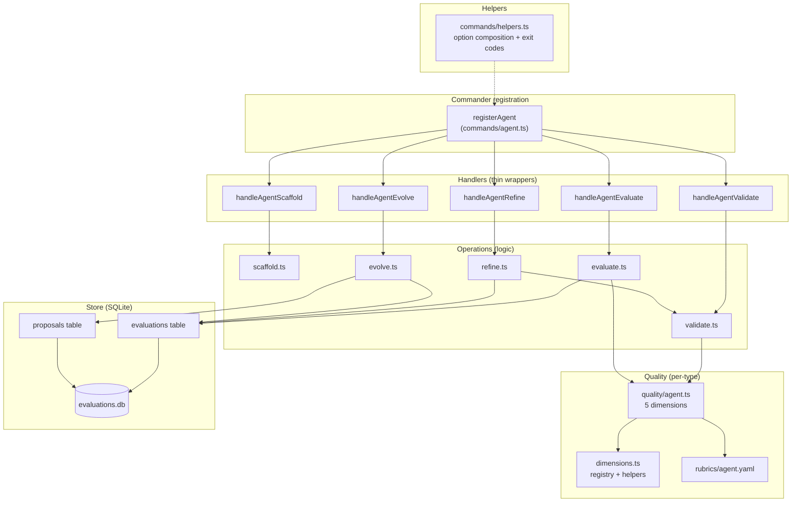
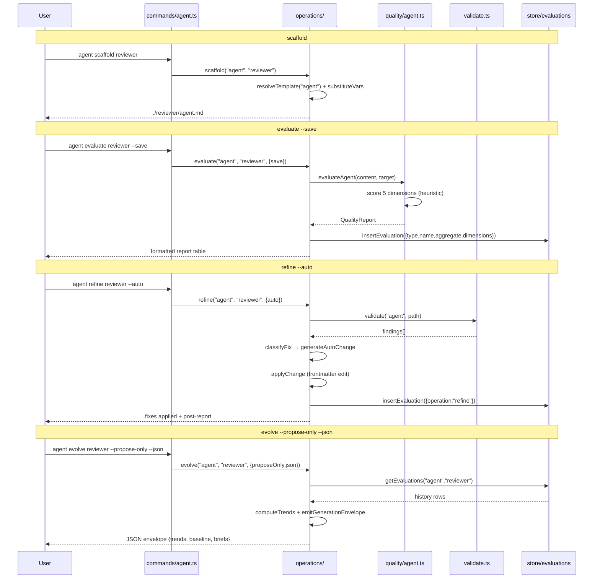
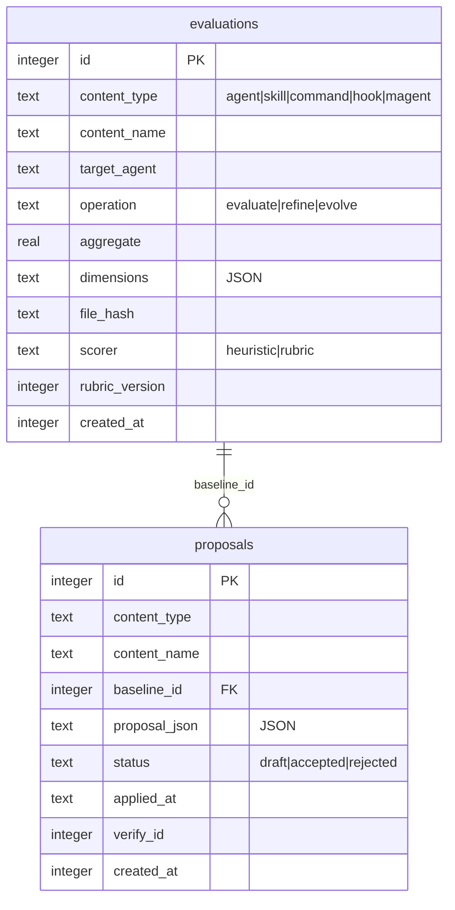
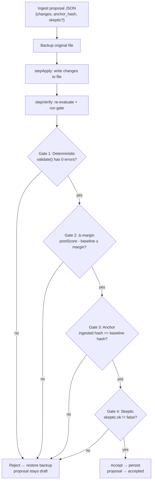

# `superskill agent`

Manage **subagent** definitions — the specialized AI workers that a main agent can delegate to. Each subagent is a markdown file with YAML frontmatter (`name`, `description`, `model`, `tools`) and a system-prompt body.

## How to use it

### Synopsis

```
superskill agent <operation> <name> [options]
```

The `agent` command exposes five operations: `scaffold`, `validate`, `evaluate`, `refine`, `evolve`.

### Operations

#### `scaffold` — create from template

```bash
superskill agent scaffold <name> [options]
```

| Option | Description | Default |
|--------|-------------|---------|
| `-d, --description <text>` | Description for the frontmatter | `''` |
| `-t, --target <agent>` | Target agent platform | `claude` |
| `-o, --output <dir>` | Output directory | CWD |
| `--force` | Overwrite an existing file | `false` |

```bash
superskill agent scaffold code-reviewer \
  --description "Senior code reviewer for PR quality checks"
```

#### `validate` — schema + format compliance

```bash
superskill agent validate <nameOrPath> [options]
```

| Option | Description | Default |
|--------|-------------|---------|
| `-t, --target <agent>` | Target agent to check format compliance against | `claude` |
| `--strict` | Enable optional/warning-level checks | `false` |
| `--json` | Output findings as JSON | `false` |

Checks: required fields (`name`, `description`, `model`, `tools`), field types, deprecated fields, model aliases (`inherit`/`sonnet`/`opus`/`haiku`), target-specific format compliance, and link validity to referenced skills.

#### `evaluate` — score quality dimensions

```bash
superskill agent evaluate <nameOrPath> [options]
```

| Option | Description | Default |
|--------|-------------|---------|
| `-t, --target <agent>` | Target agent formatting rules | `claude` |
| `--save` | Persist the report to SQLite | `false` |
| `--json` | Output the report as JSON | `false` |
| `--rubric <file>` | Rubric file (envelope-out mode with `--json`) | built-in rubric |
| `--ingest <file>` | Agent-authored scores JSON (ingest-in mode with `--save`) | — |

Scores across five agent-specific dimensions:

| Dimension | What it measures |
|-----------|------------------|
| `completeness` | Are all required subagent fields present and populated? |
| `role-clarity` | Is the role/name unambiguous and specific? |
| `tool-selection` | Are the declared tools appropriate for the role? |
| `skill-linkage` | Does the subagent reference relevant skills correctly? |
| `model-fit` | Is the model alias appropriate for the task complexity? |

#### `refine` — auto-fix and suggest

```bash
superskill agent refine <nameOrPath> [options]
```

| Option | Description | Default |
|--------|-------------|---------|
| `-t, --target <agent>` | Target agent formatting rules | `claude` |
| `--auto` | Apply low-risk fixes without prompting | `false` |
| `--save` | Persist the post-remediation report to SQLite | `false` |

Classifies each validation finding into `auto-apply` (safe defaults like missing `model`), `suggest` (requires judgment), or `flag` (manual review needed). Interactive mode prompts accept/reject/skip/quit per finding when `--auto` is not set.

#### `evolve` — longitudinal improvement

```bash
superskill agent evolve <name> [options]
```

| Option | Description | Default |
|--------|-------------|---------|
| `-t, --target <agent>` | Target agent formatting rules | `claude` |
| `--from <date>` | ISO date; analyze evaluations since then | all history |
| `--propose-only` | Generate a proposal without applying | `false` |
| `--accept <id>` | Accept and apply a specific draft proposal | — |
| `--reject <id>` | Reject a specific draft proposal | — |
| `--json` | Machine-readable JSON (envelope-out with `--propose-only`) | `false` |
| `--ingest <file>` | Agent-authored proposal JSON (ingest-in mode) | — |
| `--margin <n>` | Δ-margin gate threshold | `0.05` |

Reads evaluation history from SQLite, computes per-dimension trends, and either emits a generation envelope (`--propose-only --json`) for an external agent to author a rewrite, or ingests an agent-authored proposal (`--ingest`) through the double-loop gate.

## How it's implemented

The `agent` command follows the shared type-command architecture: a thin Commander registration layer (`commands/agent.ts`) delegates to operation modules (`operations/*.ts`) that score against type-specific quality dimensions (`quality/agent.ts`) and persist to a SQLite store (`store/`).

### Command architecture



Each handler is a one-liner over `runOperation(() => agentX(opts))` from `helpers.ts`, which maps the operation's exit code (`0` success, `1` error, `2` file not found) to `process.exit()`.

### Quality lifecycle (sequence)



### Data model (ER)

The `agent` command (and all five type commands) share one SQLite database with two tables:



- **`evaluations`** is append-only — every `evaluate --save` and `refine --save` inserts a row. `evolve` reads this history to compute trends.
- **`proposals`** has a mutable lifecycle: `draft` → `accepted` | `rejected`. `baseline_id` optionally links to the evaluation row the proposal was generated from.
- The store lives at `~/.superskill/evaluations.db`, opened by `store/db.ts` via `@gobing-ai/ts-db`.

### The evolve double-loop gate

`evolve` is the most complex operation. When an agent-authored proposal is ingested (`--ingest`), it must pass four gates before the file is rewritten:



The gates run in order; the first failure wins and names the gate in the rejection reason. On failure, the file is restored byte-identical from the backup and the proposal stays in `draft` status.

### Key source files

| File | Role |
|------|------|
| `apps/cli/src/commands/agent.ts` | Commander registration + thin handlers |
| `apps/cli/src/commands/helpers.ts` | Shared option composition (`addScaffoldOptions`, etc.) + `runOperation` / `exitFor` |
| `apps/cli/src/operations/scaffold.ts` | Template resolution + placeholder substitution |
| `apps/cli/src/operations/validate.ts` | Structural + schema + format-compliance validation |
| `apps/cli/src/operations/evaluate.ts` | Heuristic + rubric scoring; scorer seam (envelope-out / ingest-in) |
| `apps/cli/src/operations/refine.ts` | Fix classification + auto-apply + interactive review |
| `apps/cli/src/operations/evolve.ts` | Trend analysis + generation seam + double-loop gate |
| `apps/cli/src/quality/agent.ts` | Agent-specific dimension evaluators |
| `apps/cli/src/quality/dimensions.ts` | Dimension registry, required fields, scoring helpers |
| `apps/cli/src/rubrics/agent.yaml` | Rubric criteria + weights + anchors for agent dimensions |
| `apps/cli/src/store/schema.ts` | `evaluations` + `proposals` table definitions |
| `apps/cli/src/store/evaluations.ts` | `EvaluationDao` — append-only insert + history queries |
| `apps/cli/src/store/proposals.ts` | `ProposalDao` — draft/accept/reject lifecycle |
| `apps/cli/src/templates/agent/` | Default agent template with `<!-- NAME -->` etc. placeholders |

### Required frontmatter

Agent definitions require: `name`, `description`, `model`, `tools`. The `model` field accepts aliases: `inherit`, `sonnet`, `opus`, `haiku`.
