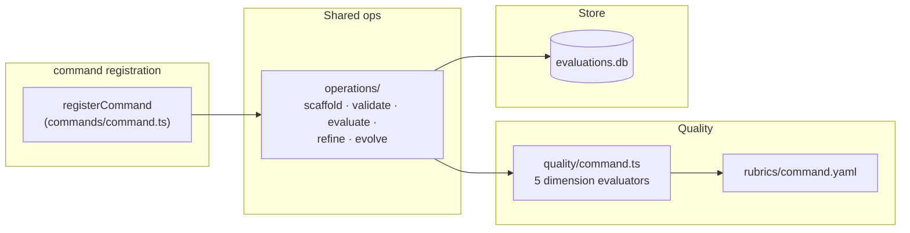

# `superskill command`

Manage **slash command** definitions — markdown files with YAML frontmatter (`name`, `description`) that define user-invoked `/command` shortcuts for a coding agent. A command file typically contains argument hints, allowed-tools declarations, and an instruction body.

## How to use it

### Synopsis

```
superskill command <operation> <name> [options]
```

The `command` command exposes the five standard operations: `scaffold`, `validate`, `evaluate`, `refine`, `evolve`. The option tables are identical to those in [`cmd_agent.md`](cmd_agent.md#how-to-use-it).

### Required frontmatter

`name`, `description`.

### Quality dimensions

| Dimension | Weight | What it measures |
|-----------|--------|------------------|
| `completeness` | 0.25 | Does the command cover its function end-to-end? Penalize missing argument validation, undocumented flags, incomplete output. |
| `clarity` | 0.25 | Is the purpose and usage unambiguous? Penalize descriptions that restate the command name without adding information. |
| `argument-hints` | 0.20 | Are argument hints present and accurate? Penalize missing hints, hints that restate the argument name, misleading hints. |
| `tool-references` | 0.15 | Are tool references (if any) correct and reachable? Penalize stale, orphaned, or undocumented references. |
| `slash-syntax` | 0.15 | Is the slash syntax correct and consistent? Penalize divergence from platform convention, inconsistent argument ordering. |

### Examples

```bash
# Create a slash command from template
superskill command scaffold deploy \
  --description "Deploy the current project to production"

# Validate with strict optional checks
superskill command validate deploy --strict

# Score and persist for evolve history
superskill command evaluate deploy --save

# Auto-fix low-risk findings
superskill command refine deploy --auto
# Preview classified fixes without writing
superskill command refine deploy --dry-run

# Generate a proposal envelope for an external agent to author a rewrite
superskill command evolve deploy --propose-only --json > proposal-brief.json

## How it's implemented

The `command` command follows the shared type-command architecture documented in [`cmd_agent.md`](cmd_agent.md#how-its-implemented): `commands/command.ts` registers five Commander subcommands that delegate to the shared operation modules (`operations/scaffold.ts`, `validate.ts`, `evaluate.ts`, `refine.ts`, `evolve.ts`). The command architecture diagram, quality lifecycle sequence, ER diagram, and double-loop gate flow are identical to the `agent` command.

### Type-specific wiring



The only differences from `agent` are:

1. **Quality evaluator** — `quality/command.ts` implements the five command-specific dimension scorers (`completeness`, `clarity`, `argument-hints`, `tool-references`, `slash-syntax`).
2. **Rubric** — `rubrics/command.yaml` supplies the criteria, weights, and excellent/poor anchors the scorer seam (`evaluate --rubric --json`) emits to the scoring agent.
3. **Required fields** — `REQUIRED_FIELDS.command = ['name', 'description']` (no `model`/`tools`).
4. **Template** — `templates/command/` provides the command-specific scaffold template.

### Key source files

| File | Role |
|------|------|
| `apps/cli/src/commands/command.ts` | Commander registration + thin handlers |
| `apps/cli/src/quality/command.ts` | Command-specific dimension evaluators |
| `apps/cli/src/rubrics/command.yaml` | Rubric criteria + weights + anchors |
| `apps/cli/src/templates/command/` | Default command template |

The shared modules (`operations/*.ts`, `commands/helpers.ts`, `quality/dimensions.ts`, `store/*`) are documented in [`cmd_agent.md`](cmd_agent.md#key-source-files).
