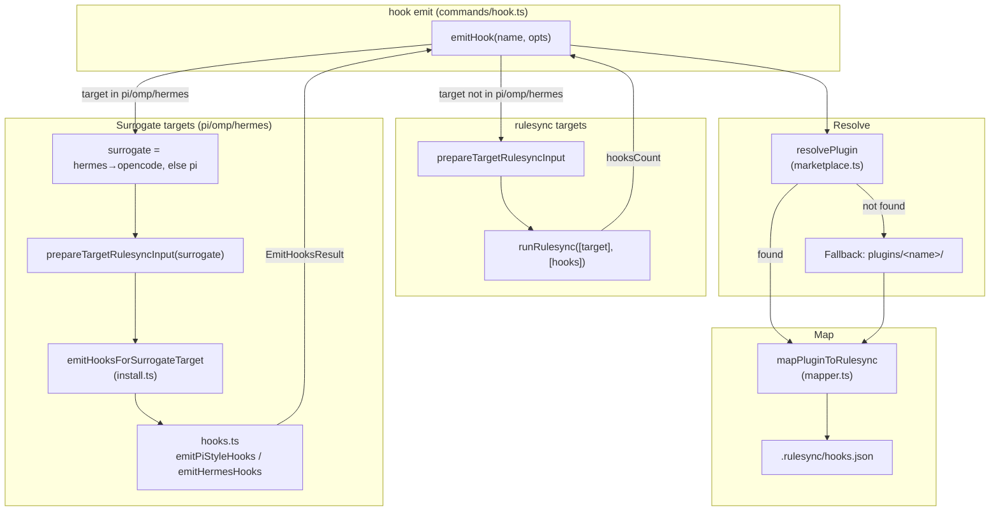
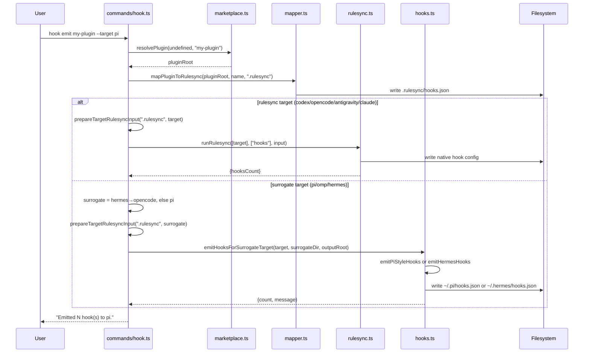

# `superskill hook`

Manage **hook** definitions — JSON configs that register shell commands to fire on agent lifecycle events (e.g. `PreToolUse`, `PostToolUse`, `Stop`). Hooks let you validate, block, or augment agent actions automatically.

The `hook` command exposes the five standard operations (`scaffold`, `validate`, `evaluate`, `refine`, `evolve`) plus one hook-only operation: **`emit`**. Note: `refine` is **suggest-only** for hooks (task 0061) — it surfaces findings as recommendations without file mutation; `evolve` is **analyze-only** (task 0056).

## How to use it

### Synopsis

```
superskill hook <operation> <name> [options]
```

### Standard operations

The standard operations mirror the other type commands, with two exceptions for hooks: `refine` is **suggest-only** (surfaces findings, no auto-apply — task 0061) and `evolve` is **analyze-only** (no apply/history/rollback — task 0056). See [`cmd_agent.md`](cmd_agent.md#how-to-use-it) for the shared option table.

**Required frontmatter:** `name`, `description`, `event`.

**Quality dimensions:**

| Dimension | Weight | What it measures |
|-----------|--------|------------------|
| `correctness` | 0.30 | Does the hook's logic produce the intended effect? Penalize wrong event, wrong mutation, wrong exit code. |
| `event-coverage` | 0.30 | Does the hook handle all events it claims to? Penalize silent no-ops and missing required events. |
| `safety` | 0.25 | Does the hook avoid destructive side effects? Penalize force-push, delete without confirmation, bypassed gates. |
| `pattern-match-quality` | 0.15 | Are the matchers precise? Penalize over-matching (fires on unrelated commands) or under-matching. |

```bash
# Create a hook from template
superskill hook scaffold block-force-push \
  --description "Block git push --force to protected branches"

# Validate and score
superskill hook validate block-force-push --strict
superskill hook evaluate block-force-push --save

# Surface findings as suggestions (suggest-only — no auto-apply for hooks)
superskill hook refine block-force-push
```

### `emit` — emit hooks to a single target (hook-only)

```bash
superskill hook emit <name> [options]
```

| Option | Description | Default |
|--------|-------------|---------|
| `-t, --target <agent>` | Target agent platform | `claude` |
| `--global` | Install to user-level global directory | `true` |
| `--dry-run` | Preview without writing files | `false` |

`emit` resolves a plugin to its canonical `.rulesync/hooks.json` and dispatches hooks to a **single** target. This is a thin wrapper over the install hook path — useful when you only want to update hooks for one agent without re-running a full install.

```bash
# Emit hooks for the pi target only
superskill hook emit my-plugin --target pi

# Preview what would be written
superskill hook emit my-plugin --target hermes --dry-run
```

## How it's implemented

The `hook` command follows the shared type-command architecture documented in [`cmd_agent.md`](cmd_agent.md#how-its-implemented): `commands/hook.ts` registers the Commander subcommands that delegate to the shared operation modules. The command architecture, quality lifecycle sequence, ER diagram, and double-loop gate are identical to the `agent` command.

The hook-only `emit` operation reuses the install pipeline's hook dispatch logic.

### Emit architecture



### Emit sequence



### Hook conversion (canonical → Pi format)

For `pi` and `omp`, canonical hook event names (camelCase) map to Pi lifecycle events via `CANONICAL_TO_PI_EVENT` in `hooks.ts`. `emitPiStyleHooks` converts the canonical `hooks.json` into the `@vahor/pi-hooks` format. For `hermes`, `emitHermesHooks` copies the canonical `hooks.json` verbatim.

### Key source files

| File | Role |
|------|------|
| `apps/cli/src/commands/hook.ts` | Commander registration (6 subcommands) + `emitHook` |
| `apps/cli/src/quality/hook.ts` | Hook-specific dimension evaluators (correctness, event-coverage, safety, pattern-match-quality) |
| `apps/cli/src/rubrics/hook.yaml` | Rubric criteria + weights + anchors |
| `apps/cli/src/templates/hook/` | Default hook template |
| `apps/cli/src/hooks.ts` | Canonical → Pi-hooks conversion; `emitPiStyleHooks` / `emitHermesHooks` |
| `apps/cli/src/commands/install.ts` | `emitHooksForSurrogateTarget` (reused by `hook emit`) |

The shared modules (`operations/*.ts`, `commands/helpers.ts`, `quality/dimensions.ts`, `store/*`) are documented in [`cmd_agent.md`](cmd_agent.md#key-source-files).
