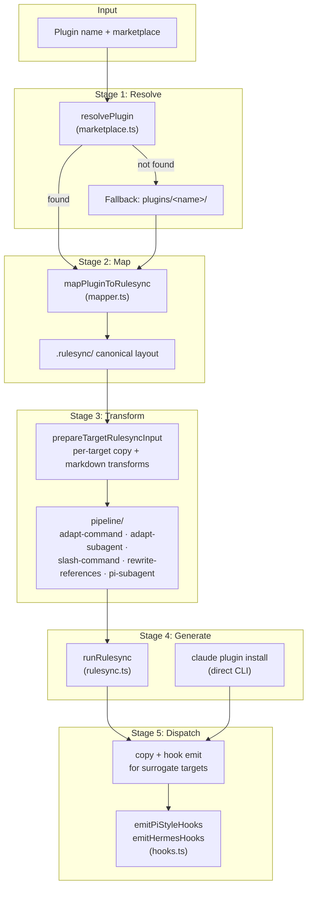
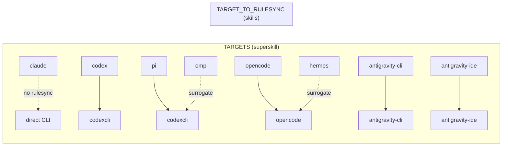
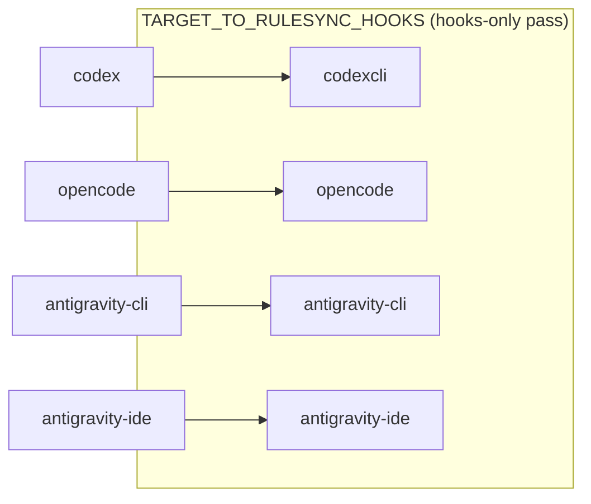
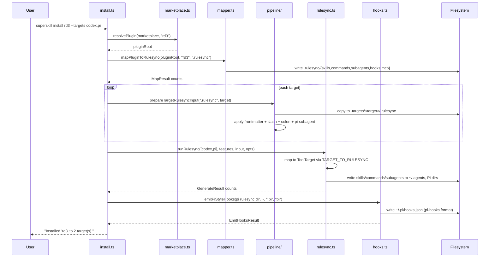

# `superskill install`

Distribute a Claude Code plugin's skills, commands, subagents, hooks, and MCP config to any supported target coding agent. Hooks are routed through a separate rulesync pass so each target reaches its native hook generator.

## How to use it

### Synopsis

```
superskill install [options] <plugin>
```

### Arguments and options

| Argument / Option | Description | Default |
|-------------------|-------------|---------|
| `<plugin>` | Plugin name to install (required). Resolved via marketplace manifest or `plugins/<name>/`. | — |
| `--marketplace <path>` | Path to `.claude-plugin/marketplace.json` or its containing directory. | CWD's `.claude-plugin/` |
| `--targets <list>` | Comma-separated target agents, or `all`. | all configured |
| `--no-global` | Install to project-level instead of user-level global directories. | `false` (global) |
| `--dry-run` | Preview the install without writing files. | `false` |
| `--verbose` | Print each pipeline step and file copy. | `false` |

### Examples

```bash
# Install a plugin to every supported target (global, user-level)
superskill install rd3 --targets all

# Install to specific targets only
superskill install rd3 --targets codex,pi,antigravity-cli

# Preview what would be written, no filesystem changes
superskill install rd3 --targets all --dry-run --verbose

# Install to the current project instead of user home
superskill install rd3 --targets codex --no-global
```

### Supported targets

| Target | Engine | Output location (global) |
|--------|--------|--------------------------|
| `claude` | `claude plugin install` CLI | Claude Code marketplace |
| `codex` | rulesync | `~/.agents/skills/` |
| `pi` | rulesync + superskill hook shim | `~/.agents/skills/` (+ `~/.pi/agent/agents/` for agents) |
| `omp` | native (reads `~/.agents/skills/`) + hook shim | `~/.agents/skills/` |
| `opencode` | rulesync | `~/.config/opencode/skills/` |
| `antigravity-cli` | rulesync | `~/.gemini/antigravity-cli/skills/` |
| `antigravity-ide` | rulesync | `~/.gemini/config/skills/` |
| `hermes` | superskill copy (via `opencode` surrogate) | `~/.hermes/skills/` |
| `openclaw` | implicit (reads `~/.agents/skills/`) | Shared skills root — no dedicated dispatch |

## How it's implemented

The install command is a five-stage pipeline: **resolve → map → transform → generate → dispatch**. The entry point is `executeInstall()` in `apps/cli/src/commands/install.ts`.

### Architecture



### Stage 1 — Resolve the plugin

`resolvePlugin()` (in `marketplace.ts`) parses the `.claude-plugin/marketplace.json` manifest with a Zod schema and returns the plugin root directory. If no marketplace is found, the install falls back to scanning `plugins/<name>/plugin.json`. If neither resolves, it throws with the list of available plugin names.

### Stage 2 — Map to the canonical `.rulesync/` layout

`mapPluginToRulesync()` (in `mapper.ts`) translates the Claude Code plugin directory into the `.rulesync/` canonical layout that `rulesync.generate()` expects:

| Plugin source | Canonical target |
|---------------|------------------|
| `skills/*.md` | `.rulesync/skills/<plugin>-<name>/SKILL.md` |
| `commands/*.md` | `.rulesync/commands/<plugin>-<name>.md` |
| `agents/*.md` | `.rulesync/subagents/<plugin>-<name>.md` |
| `hooks.json` | deep-merged into `.rulesync/hooks.json` |
| `mcp.json` | deep-merged into `.rulesync/mcp.json` |

Missing optional directories are handled gracefully — nothing is created for absent inputs.

### Stage 3 — Target-specific transforms

`prepareTargetRulesyncInput()` copies the canonical `.rulesync/` into a per-target root (`$sourceRoot/.targets/$target/.rulesync`) and applies target-specific markdown transforms via the `pipeline/` modules:

| Pipeline module | Transform | Applies to |
|-----------------|-----------|------------|
| `frontmatter-walk.ts` | Walk frontmatter blocks for adaptation stages | adapt-command, adapt-subagent |
| `adapt-command.ts` | Adapt command `.md` → Skills 2.0 skill entry (`disable-model-invocation: true`) | all non-Claude targets |
| `adapt-subagent.ts` | Adapt subagent `.md` → Skills 2.0 skill entry (model-invocable) | all non-Claude targets |
| `slash-command.ts` | Translate `/plugin-command` ↔ `/skill:` dialects | pi, omp, opencode, antigravity, hermes |
| `rewrite-references.ts` | Rewrite `<pluginPrefix>:name` → `<pluginPrefix>-name` (plugin-prefix-scoped) | all non-Claude targets |
| `pi-subagent.ts` | Convert subagent frontmatter to Pi native agent format | pi, omp |
Target-to-rulesync and target-to-agent-name mappings live in `targets.ts`. **Skills and hooks use separate maps** (task 0151): skills collapse Antigravity onto `codexcli` so all `~/.agents/skills/` readers share one copy; hooks must NOT share that routing, because rulesync ships native Antigravity hook generators that would emit codex-style files at the wrong path.





`omp` reuses `pi`'s rulesync output; `hermes` reuses `opencode`'s (ADR-010). Claude, omp, and hermes have no rulesync mapping and are skipped by `runRulesync()`. The hooks map omits `pi`/`omp`/`hermes` — those targets get hooks via the surrogate shim (pi-hooks format for pi/omp, verbatim copy for hermes).

### Stage 4 — Generate target outputs

Two generation paths:

1. **rulesync path** (`runRulesync` in `rulesync.ts`) — calls `rulesync.generate()` programmatically (not the CLI) with the mapped `ToolTarget` strings, the per-target input root, and `outputRoots` set to `homedir()` (global) or `process.cwd()` (project). rulesync writes skills, commands, subagents, and MCP configs to each target's native directory.

   **Two-pass hook routing (task 0151):** `hooks` is NOT carried in the main pass. The main pass carries `skills` (+ `mcp` when present) through the skills map (`TARGET_TO_RULESYNC`). When the plugin produced a canonical `hooks.json` (`mapResult.hooks`), a **second hooks-only pass** routes through `TARGET_TO_RULESYNC_HOOKS` so each Antigravity target reaches its own native hook generator (`antigravity-cli` → `.agents/hooks.json` project, `antigravity-ide` → `.gemini/config/hooks.json` global) instead of being collapsed onto `codexcli` (which would emit codex-style hook files at the wrong path). `pi`/`omp` have no rulesync hook target and are handled by the surrogate shim below; `hermes` gets `hooks.json` copied verbatim. A hookless plugin makes a single skills-only pass.

2. **Claude path** — spawns `claude plugin install <plugin>@local --path <pluginRoot>` directly, inheriting stdio.

### Stage 5 — Dispatch surrogate targets + emit hooks

For targets rulesync does not cover, superskill copies the surrogate's generated output and emits hooks:

- **`hermes`** — copies `opencode` rulesync skills to `~/.hermes/skills/`, then `emitHermesHooks()` copies the canonical `hooks.json` to `~/.hermes/hooks.json`.
- **`omp`** — reads skills from shared `~/.agents/skills/` natively; `emitPiStyleHooks()` converts canonical hooks to `@vahor/pi-hooks` format at `~/.omp/agent/hooks.json`.
- **`pi`** — rulesync emits skills (to `~/.agents/skills/`) but not hooks; `emitPiStyleHooks()` fills the gap with the `@vahor/pi-hooks` shim.

Hook emission results are always surfaced (no silent drop) — each `EmitHooksResult.message` is printed to stdout.

### Sequence diagram



### Key source files

| File | Role |
|------|------|
| `apps/cli/src/commands/install.ts` | Command registration, `executeInstall()` orchestration, target dispatch |
| `apps/cli/src/hooks.ts` | Canonical → Pi-hooks conversion; `emitPiStyleHooks` / `emitHermesHooks` |
| `packages/core/src/marketplace.ts` | Plugin resolution from marketplace manifest (Zod-validated) |
| `packages/core/src/mapper.ts` | Plugin → `.rulesync/` canonical layout mapping |
| `packages/core/src/rulesync.ts` | Thin programmatic wrapper over `rulesync.generate()` |
| `packages/core/src/targets.ts` | Target enum + `TARGET_TO_RULESYNC` (skills) / `TARGET_TO_RULESYNC_HOOKS` (hooks) / `TARGET_TO_AGENT_NAME` maps |
| `packages/core/src/pipeline/adapt-command.ts` | Adapt Claude Code command `.md` → Skills 2.0 skill entry |
| `packages/core/src/pipeline/adapt-subagent.ts` | Adapt Claude Code subagent `.md` → Skills 2.0 skill entry |
| `packages/core/src/pipeline/slash-command.ts` | Slash-dialect translation per target |
| `packages/core/src/pipeline/rewrite-references.ts` | Plugin-prefix-scoped `plugin:name` → `plugin-name` rewriting |
| `packages/core/src/pipeline/frontmatter-walk.ts` | Shared frontmatter-block walker for adapt-* stages |
| `packages/core/src/pipeline/pi-subagent.ts` | Subagent → Pi native agent frontmatter conversion |
| `packages/core/src/pipeline/pi-tools.ts` | Claude → Pi tool-name normalization |

### Design notes

- **ADR-010 (surrogate targets)** — `omp` and `hermes` have no rulesync engine of their own. They reuse `pi` and `opencode` rulesync output respectively, then superskill copies the generated files and emits target-specific hooks.
- **`outputRoots` is mandatory** — `runRulesync()` always passes `outputRoots: [homedir() | cwd()]`. Relying on rulesync's default (`process.cwd()`) would write to the wrong place.
- **Hooks are never silently dropped** — every `EmitHooksResult.message` is echoed, even in non-verbose mode, so the user knows what hook shims were installed.
- **`--dry-run`** propagates through rulesync (`dryRun: true`) and skips all filesystem copies and the `claude plugin install` spawn.
- **Two-pass hook routing (task 0151)** — Hooks ride in a separate rulesync pass through `TARGET_TO_RULESYNC_HOOKS`. The skills map collapses Antigravity onto `codexcli` (so all `~/.agents/skills/` readers share one copy), but reusing that routing for hooks would make rulesync emit codex-style hook files at the wrong path instead of the native `.agents/hooks.json` (Antigravity CLI, project) / `.gemini/config/hooks.json` (Antigravity IDE, global). The hooks-only pass runs only when the plugin produced a canonical `hooks.json`; a hookless plugin makes a single skills-only pass.
