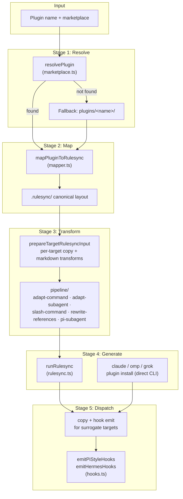
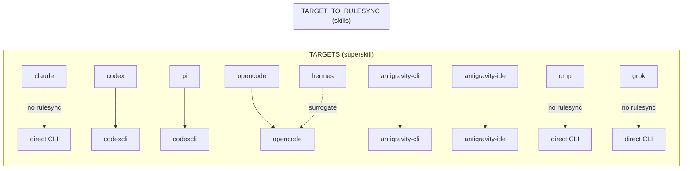
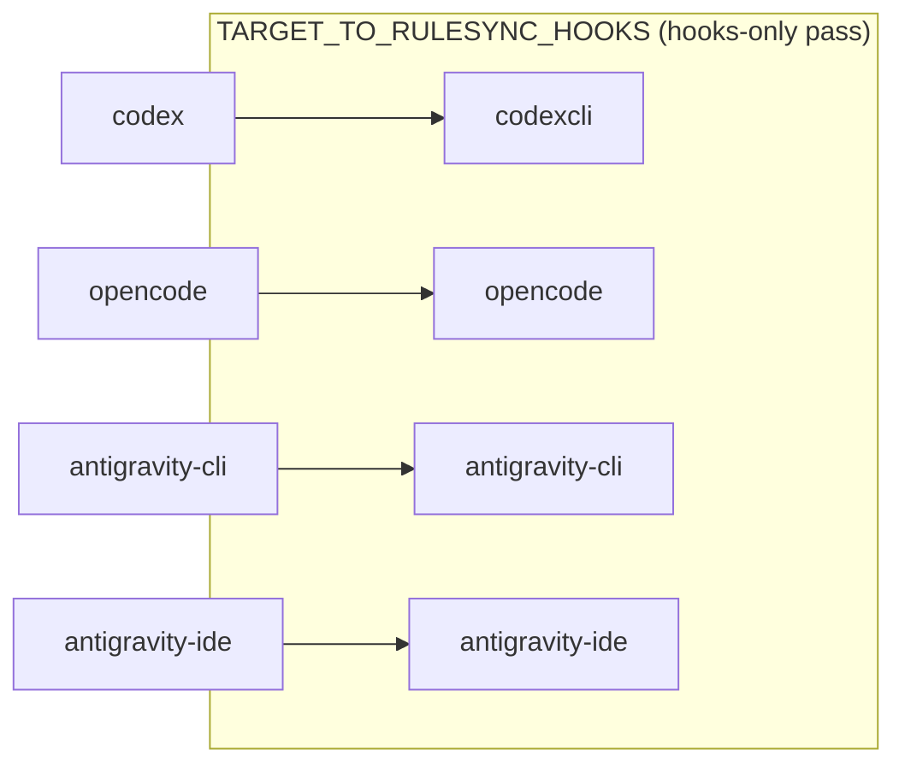
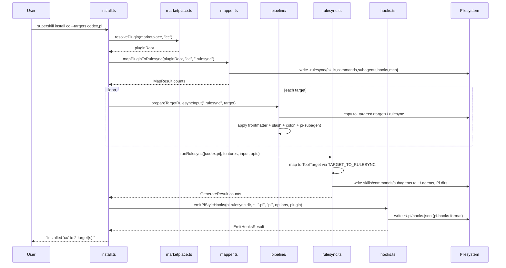

# `superskill install`

Distribute a Claude Code plugin's skills, commands, subagents, **magents** (main-agent configs), hooks, and MCP config to any supported target coding agent. Hooks are routed through a separate rulesync pass so each target reaches its native hook generator.

## How to use it

### Synopsis

```
superskill install [options] <plugin>
```

### Arguments and options

| Argument / Option | Description | Default |
| ------------------- | ------------- | --------- |
| `<plugin>` | Plugin name to install (required) — a bare segment, never a URL/path. Resolved via marketplace manifest, installed package root, or `plugins/<name>/`. | — |
| `--marketplace <locator>` | Marketplace locator (ADR-034). A local path (probed as direct `marketplace.json` file → `<X>/marketplace.json` → `<X>/.claude-plugin/marketplace.json`), a GitHub URL (`https://github.com/owner/repo[/tree/<ref>[/subpath]]`), or `owner/repo` shorthand. **Local-first:** an existing path is local; only a non-existent `owner/repo` is GitHub shorthand; `https://`/`git@` are always remote. Remote content caches at `~/.cache/superskill/marketplaces/<owner>/<repo>/<ref>/` (warm cache resolves offline). | CWD's `.claude-plugin/`, then installed package root |
| `--targets <list>` | Comma-separated target agents, or `all`. | all configured |
| `--no-global` | Install to project-level instead of user-level global directories. | `false` (global) |
| `--magent <name>` | Select which main-agent package under `magents/` to emit. Required when the plugin ships more than one; auto-selects when exactly one exists. | auto when unique |
| `--marketplace-source <mode>` | **Deprecated** (ADR-034): warns to stderr, keeps behavior, removal planned. Prefer `--marketplace <locator>`. | `directory` |
| `--dry-run` | Preview the install without writing files. | `false` |
| `--verbose` | Print each pipeline step and file copy. | `false` |
| `--prune` | Remove leftover dest skill dirs matching `<plugin>-*` on flattened skills dests (`~/.agents/skills/`, `~/.config/opencode/skills/`, `~/.gemini/*/skills/`, `~/.hermes/skills/`) and replace remaining `<plugin>-*` dirs so intra-dir leftovers disappear. Shared skills roots stay multi-plugin — only the installing plugin's dirs are touched; other plugins' `cc-*`/`wt-*` dirs are never deleted. Native plugin-tree dests (`claude`, `grok`, `omp`) own their own trees and are pruned by their host plugin CLIs, not by this flag. Default install (no `--prune`) stays additive. | `false` |

Project-local `superskill.jsonc` may provide plugin paths, targets, and feature defaults. The parser
accepts JSONC comments and trailing commas. Explicit `--marketplace` and `--targets` flags win;
otherwise the matching configured plugin path is preferred over ambient marketplace discovery and
configured targets are used (an empty list means all). `features` filters
`skills|commands|subagents|hooks|mcp`; native Claude/OMP/Grok targets reject partial filters because
their host installers install the complete package.

### Examples

```bash
# Install a plugin to every supported target (global, user-level)
superskill install cc --targets all

# Install to specific targets only
superskill install cc --targets codex,pi,antigravity-cli

# Install skills/hooks + emit the team-stark-children main agent
superskill install cc --magent team-stark-children --verbose

# Project-local main-agent files (CLAUDE.md / AGENTS.md at cwd)
superskill install cc --magent team-stark-children --no-global --targets claude,codex

# Preview what would be written, no filesystem changes
superskill install cc --targets all --dry-run --verbose

# Zero-clone install from a registry install (no --marketplace needed):
#   bun add -g @gobing-ai/superskill
#   superskill install cc --magent team-stark-children
# The CLI self-locates its own bundled plugin content from any directory.

# Install from a GitHub marketplace (URL or owner/repo shorthand):
superskill install cc --marketplace gobing-ai/superskill --verbose
superskill install cc --marketplace https://github.com/gobing-ai/superskill --verbose

# Remove leftover dest skill dirs for this plugin only (renamed/deleted skills)
superskill install cc --targets codex,pi --prune
```

### Supported targets

| Target | Engine | Output location (global) |
| -------- | -------- | -------------------------- |
| `claude` | `claude plugin install` CLI | Claude Code marketplace |
| `codex` | rulesync | `~/.agents/skills/` |
| `pi` | rulesync + superskill hook shim | `~/.agents/skills/` (+ `~/.pi/agent/agents/` for agents) |
| `omp` | native (`omp plugin install` via claude-plugins provider) + hook shim | `~/.omp/plugins/cache/plugins/<marketplace>___<plugin>___<version>/` |
| `grok` | native (`grok plugin install` CLI, Claude-format package) | `~/.grok/installed-plugins/<plugin>-<hash>/` |
| `opencode` | rulesync | `~/.config/opencode/skills/` |
| `antigravity-cli` | rulesync | `~/.gemini/antigravity-cli/skills/` |
| `antigravity-ide` | rulesync | `~/.gemini/config/skills/` |
| `hermes` | superskill copy (via `opencode` surrogate) | `~/.hermes/skills/` |
| `openclaw` | implicit (reads `~/.agents/skills/`) | Shared skills root — no dedicated dispatch |
| `grok-bot` | native Sand workflow writer (opt-in) | `<sandRoot>/workflows/<plugin>-<name>/SKILL.md` (bridge / full) |

*Note: `grok-bot` is an opt-in, install-only target (ADR-036), excluded from `--targets all`. See [entity locations](entity_locations.md) and the [Native cc Marketplace Pilot](native_cc_marketplace_pilot.md) for details.*

## How it's implemented

The install command is a five-stage pipeline: **resolve → map → transform → generate → dispatch**. The entry point is `executeInstall()` in `apps/cli/src/commands/install.ts`.

### Architecture


```mermaid
flowchart TD
    subgraph Input
        P["Plugin name + marketplace"]
    end

    subgraph "Stage 1: Resolve"
        R["resolvePlugin<br/>(marketplace.ts)"]
        RF["Fallback: plugins/&lt;name&gt;/"]
    end

    subgraph "Stage 2: Map"
        M["mapPluginToRulesync<br/>(mapper.ts)"]
        RR[".rulesync/ canonical layout"]
    end

    subgraph "Stage 3: Transform"
        T["prepareTargetRulesyncInput<br/>per-target copy + markdown transforms"]
        TT["pipeline/<br/>adapt-command · adapt-subagent ·<br/>slash-command · rewrite-references · pi-subagent"]
    end

    subgraph "Stage 4: Generate"
        G["runRulesync<br/>(rulesync.ts)"]
    CL["claude / omp / grok<br/>plugin install (direct CLI)"]
    end

    subgraph "Stage 5: Dispatch"
        D["copy + hook emit<br/>for surrogate targets"]
        H["emitPiStyleHooks<br/>emitHermesHooks<br/>(hooks.ts)"]
    end

    P --> R
    R -->|found| M
    R -->|not found| RF
    RF --> M
    M --> RR
    RR --> T
    T --> TT
    TT --> G
    G --> D
    CL --> D
    D --> H
```

### Stage 1 — Resolve the plugin

`resolvePlugin()` (in `marketplace.ts`) probes the `--marketplace` locator with a uniform three-way rule (direct `marketplace.json` file → `<X>/marketplace.json` → `<X>/.claude-plugin/marketplace.json`), parses the manifest with a Zod schema, and returns the plugin root directory plus the derived `marketplaceRoot`. A remote locator (GitHub URL / `owner/repo`) is materialized into `~/.cache/superskill/marketplaces/<owner>/<repo>/<ref>/` first via the shared skills-ecosystem fetch layer, so the local resolve flow runs unchanged (ADR-034). When no `--marketplace` is given, the install probes the CWD `.claude-plugin/`, then its own installed package root (self-location, so a registry install works from any directory), then falls back to scanning `plugins/<name>/plugin.json`. If none resolves, it throws with the list of available plugin names.

### Stage 2 — Map to the canonical `.rulesync/` layout

`mapPluginToRulesync()` (in `mapper.ts`) translates the Claude Code plugin directory into the `.rulesync/` canonical layout that `rulesync.generate()` expects:

| Plugin source | Canonical target |
| --------------- | ------------------ |
| `skills/*.md` | `.rulesync/skills/<plugin>-<name>/SKILL.md` |
| `commands/*.md` | `.rulesync/commands/<plugin>-<name>.md` |
| `agents/*.md` | `.rulesync/subagents/<plugin>-<name>.md` |
| `magents/<name>/` | `.rulesync/magents/<plugin>-<name>/` (tree preserved; not downgraded to skills) |
| `hooks.json` | deep-merged into `.rulesync/hooks.json` |
| `mcp.json` | deep-merged into `.rulesync/mcp.json` |

Missing optional directories are handled gracefully — nothing is created for absent inputs.

#### Dest fidelity: flattened path rewrite + native exemption

Command and subagent bodies often link to companion skill files with repo-relative paths (`../skills/<name>/references/…`, or `plugins/<plugin>/skills/<name>/…` from top-level docs). After install, these links must resolve in the dest — but the dest layout differs by target class:

- **Flattened skills dests** (`codex`, `pi`, `opencode`, `antigravity-cli`, `antigravity-ide`, `hermes`) downgrade commands/subagents to `~/.<root>/skills/<plugin>-<name>/SKILL.md` under a shared skills root. The companion is a sibling dest skill, so `adaptCommandToSkill` / `adaptSubagentToSkill` rewrite those links to `../<plugin>-<name>/…` at map time (`rewritePluginTreeMarkdownLinks` in `pipeline/rewrite-plugin-tree-links.ts`). Command-as-skill and subagent-as-skill dest dirs receive `SKILL.md` only — a wrapped skill's `references/` (and other companions) are **not** copied next to them.
- **Native plugin-tree dests** (`claude`, `grok`, `omp`) install the full Claude-format plugin tree via their own host CLIs and keep resolving `../skills/<name>/…` against it. The rewriter is **never** applied to them — the seam is structural: the mapper output (`.rulesync/`) only feeds flattened dests, while native installs read the raw `pluginRoot` directly, so their command/agent files keep source repo-relative paths byte-identical for those links.

`plugin:name` colon references are owned by a separate rewriter (`rewriteSkillReferences`) and are not affected by the path rewrite.

### Magents (main-agent configs)

**Two discovery roots** (staged into `.rulesync/magents/`):

1. `plugins/<plugin>/magents/` — plugin-shipped packages (prefixed `<plugin>-<name>`).
2. Marketplace-root `magents/` — **mutable authoring SSOT** (bare `<name>`), e.g. `magents/team-stark-children/`.

**Selection (must stay correct for plugins with zero magents):**

| Situation | Behavior |
| --- | --- |
| No magents staged | Silent no-op (skills/hooks/rules still install). Verbose: “none staged”. |
| Exactly one **plugin-owned** package (`<plugin>-*`) | Auto-select. |
| Marketplace bare package(s) only | Require `--magent <name>` (never auto-install on `install sp` just because the monorepo has a persona). |
| Multiple packages, no `--magent` | Skip emission; verbose lists staged names. |
| `--magent <name>` | Require a match or fail loudly. |

After selection, emission:

1. **Claude import-style** (`CLAUDE.md` contains `@IDENTITY.md` etc.): copy modular package files + `CLAUDE.md` into dest (`~/.claude` global or project root). Claude expands `@` at session start.
2. **Other targets / non-import packages:** `assembleMagentContent` — multi-file concat `IDENTITY → SOUL → AGENTS → USER` (overrides win) or single-file `AGENTS.<target>.md`. Codex strips bare `@file` lines.
3. **Plugin rules:** copy `plugins/<plugin>/rules/*.md` into each target’s rules directory when one exists (claude → `.claude/rules/`; antigravity → `.agents/rules/`). Independent of `--magent`. Skip with a verbose note when the target has no rules folder.

Examples:

```bash
# Plugin with no magents (e.g. spur's sp): skills/hooks only — never fails on missing magent
superskill install sp --targets all

# Persona from monorepo magents/ (explicit)
superskill install cc --magent team-stark-children --verbose
```

### Stage 3 — Target-specific transforms

`prepareTargetRulesyncInput()` copies the canonical `.rulesync/` into a per-target root (`$sourceRoot/.targets/$target/.rulesync`) and applies target-specific markdown transforms via the `pipeline/` modules:

| Pipeline module | Transform | Applies to |
| ----------------- | ----------- | ------------ |
| `frontmatter-walk.ts` | Walk frontmatter blocks for adaptation stages | adapt-command, adapt-subagent |
| `adapt-command.ts` | Adapt command `.md` → Skills 2.0 skill entry (`disable-model-invocation: true`) | all non-Claude targets |
| `adapt-subagent.ts` | Adapt subagent `.md` → Skills 2.0 skill entry (model-invocable) | all non-Claude targets |
| `slash-command.ts` | Translate `/plugin-command` ↔ `/skill:` dialects | pi, omp, opencode, antigravity, hermes |
| `rewrite-references.ts` | Rewrite `<pluginPrefix>:name` → `<pluginPrefix>-name` (plugin-prefix-scoped) | all non-Claude targets |
| `pi-subagent.ts` | Convert subagent frontmatter to Pi native agent format | pi, omp |
Target-to-rulesync and target-to-agent-name mappings live in `targets.ts`. **Skills and hooks use separate maps** (task 0151): skills collapse Antigravity onto `codexcli` so all `~/.agents/skills/` readers share one copy; hooks must NOT share that routing, because rulesync ships native Antigravity hook generators that would emit codex-style files at the wrong path.


```mermaid
flowchart LR
    subgraph "TARGETS (superskill)"
        CL[claude] -.->|"no rulesync"| DIRECT[direct CLI]
        CX[codex] --> RCX[codexcli]
        PI[pi] --> RPI[codexcli]
        OC[opencode] --> ROC[opencode]
        AGCLI[antigravity-cli] --> RAGCLI[antigravity-cli]
        AGIDE[antigravity-ide] --> RAGIDE[antigravity-ide]
        OMP[omp] -.->|"no rulesync"| OMPDIRECT[direct CLI]
        GRK[grok] -.->|"no rulesync"| GRKDIRECT[direct CLI]
        HE[hermes] -.->|"surrogate"| ROC
    end
    subgraph "TARGET_TO_RULESYNC (skills)"
        RCX
        RPI
        ROC
        RAGCLI
        RAGIDE
    end
```


```mermaid
flowchart LR
    CX[codex] --> RCX[codexcli]
    OC[opencode] --> ROC[opencode]
    AGCLI[antigravity-cli] --> RAGCLI[antigravity-cli]
    AGIDE[antigravity-ide] --> RAGIDE[antigravity-ide]
    subgraph "TARGET_TO_RULESYNC_HOOKS (hooks-only pass)"
        RCX
        ROC
        RAGCLI
        RAGIDE
    end
```

`omp` and `grok` install natively via their own plugin CLIs (no rulesync pass); `hermes` reuses `opencode`'s rulesync output (ADR-010). Claude, omp, grok, and hermes have no rulesync mapping and are skipped by `runRulesync()`. The hooks map omits `pi`/`omp`/`grok`/`hermes` — `pi`/`omp` get hooks via the pi-hooks surrogate shim; `grok` consumes `hooks.json` natively; `hermes` gets a verbatim `hooks.json` copy.

### Stage 4 — Generate target outputs

Two generation paths:

1. **rulesync path** (`runRulesync` in `rulesync.ts`) — calls `rulesync.generate()` programmatically (not the CLI) with the mapped `ToolTarget` strings, the per-target input root, and `outputRoots` set to `homedir()` (global) or `process.cwd()` (project). rulesync writes skills, commands, subagents, and MCP configs to each target's native directory.

   **Two-pass hook routing (task 0151):** `hooks` is NOT carried in the main pass. The main pass carries `skills` (+ `mcp` when present) through the skills map (`TARGET_TO_RULESYNC`). When the plugin produced a canonical `hooks.json` (`mapResult.hooks`), a **second hooks-only pass** routes through `TARGET_TO_RULESYNC_HOOKS` so each Antigravity target reaches its own native hook generator (`antigravity-cli` → `.agents/hooks.json` project, `antigravity-ide` → `.gemini/config/hooks.json` global) instead of being collapsed onto `codexcli` (which would emit codex-style hook files at the wrong path). `pi`/`omp` have no rulesync hook target and are handled by the surrogate shim below; `hermes` gets `hooks.json` copied verbatim. A hookless plugin makes a single skills-only pass.

2. **Native plugin paths** — `claude`, `omp`, and `grok` each install via their own plugin CLIs (`claude plugin install`, `omp plugin install`, `grok plugin install`), receiving the full Claude-format plugin tree. These three targets all receive plugin-level `scripts/` natively.

### Stage 5 — Dispatch surrogate targets + emit hooks

For targets rulesync does not cover, superskill either installs natively (omp, grok) or copies the surrogate's generated output and emits hooks:

- **`hermes`** — copies `opencode` rulesync skills to `~/.hermes/skills/`, then `emitHermesHooks()` copies the canonical `hooks.json` to `~/.hermes/hooks.json`.
- **`omp`** — installs natively via `omp plugin install` (full plugin tree at `~/.omp/plugins/cache/`); `generateOmpHookModules()` reconciles plugin-owned native modules under `hooks/pre/` and `hooks/post/`. The separate `hook emit` operation uses Pi-style `@vahor/pi-hooks` config at `~/.omp/agent/hooks.json`.
- **`pi`** — rulesync emits skills (to `~/.agents/skills/`) but not hooks; `emitPiStyleHooks()` fills the gap with the `@vahor/pi-hooks` shim and replaces the installing plugin's previous projection while preserving user and foreign-plugin entries.
- **`grok`** — installs natively via `grok plugin install <path> --trust` (full plugin tree at `~/.grok/installed-plugins/<plugin>-<hash>/`); no hook shim, direct Claude-format plugin.

Hook emission results are always surfaced (no silent drop) — each `EmitHooksResult.message` is printed to stdout.

### Sequence diagram


```mermaid
sequenceDiagram
    participant User
    participant CLI as install.ts
    participant MP as marketplace.ts
    participant Map as mapper.ts
    participant Pipe as pipeline/
    participant RS as rulesync.ts
    participant H as hooks.ts
    participant FS as Filesystem

    User->>CLI: superskill install cc --targets codex,pi
    CLI->>MP: resolvePlugin(marketplace, "cc")
    MP-->>CLI: pluginRoot
    CLI->>Map: mapPluginToRulesync(pluginRoot, "cc", ".rulesync")
    Map->>FS: write .rulesync/{skills,commands,subagents,hooks,mcp}
    Map-->>CLI: MapResult counts

    loop each target
        CLI->>Pipe: prepareTargetRulesyncInput(".rulesync", target)
        Pipe->>FS: copy to .targets/<target>/.rulesync
        Pipe->>Pipe: apply frontmatter + slash + colon + pi-subagent
    end

    CLI->>RS: runRulesync([codex,pi], features, input, opts)
    RS->>RS: map to ToolTarget via TARGET_TO_RULESYNC
    RS->>FS: write skills/commands/subagents to ~/.agents, Pi dirs
    RS-->>CLI: GenerateResult counts

    CLI->>H: emitPiStyleHooks(pi rulesync dir, ~, ".pi", "pi", options, plugin)
    H->>FS: write ~/.pi/hooks.json (pi-hooks format)
    H-->>CLI: EmitHooksResult

    CLI-->>User: "Installed 'cc' to 2 target(s)."
```

### Key source files

| File | Role |
| ------ | ------ |
| `apps/cli/src/commands/install.ts` | Command registration, `executeInstall()` orchestration, target dispatch |
| `apps/cli/src/hooks.ts` | Canonical → Pi-hooks conversion; `emitPiStyleHooks` / `emitHermesHooks` |
| `packages/core/src/marketplace.ts` | Plugin resolution from marketplace manifest (Zod-validated) |
| `packages/core/src/mapper.ts` | Plugin → `.rulesync/` canonical layout mapping |
| `packages/core/src/rulesync.ts` | Thin programmatic wrapper over `rulesync.generate()` |
| `packages/core/src/targets.ts` | Target enum + `TARGET_TO_RULESYNC` (skills) / `TARGET_TO_RULESYNC_HOOKS` (hooks) / `TARGET_TO_AGENT_NAME` maps |
| `packages/core/src/pipeline/adapt-command.ts` | Adapt Claude Code command `.md` → Skills 2.0 skill entry |
| `packages/core/src/pipeline/adapt-subagent.ts` | Adapt Claude Code subagent `.md` → Skills 2.0 skill entry |
| `packages/core/src/pipeline/slash-command.ts` | Slash-dialect translation per target |
| `packages/core/src/pipeline/rewrite-references.ts` | Plugin-prefix-scoped `plugin:name` → `plugin-name` rewriting |
| `packages/core/src/pipeline/frontmatter-walk.ts` | Shared frontmatter-block walker for adapt-* stages |
| `packages/core/src/pipeline/pi-subagent.ts` | Subagent → Pi native agent frontmatter conversion |
| `packages/core/src/pipeline/pi-tools.ts` | Claude → Pi tool-name normalization |

### Design notes

- **ADR-010 (surrogate targets)** — `hermes` has no rulesync engine of its own; it reuses `opencode` rulesync output, then superskill copies the generated files and emits `hooks.json` verbatim. `omp` and `grok` install natively via their own plugin CLIs (no rulesync pass), so they receive the full Claude-format plugin tree. `pi` uses the `codexcli` rulesync output for skills (`~/.agents/skills/`) but needs `emitPiStyleHooks()` to convert hooks to `@vahor/pi-hooks` format.
- **`outputRoots` is mandatory** — `runRulesync()` always passes `outputRoots: [homedir() | cwd()]`. Relying on rulesync's default (`process.cwd()`) would write to the wrong place.
- **Hooks are never silently dropped** — every `EmitHooksResult.message` is echoed, even in non-verbose mode, so the user knows what hook shims were installed.
- **`--dry-run`** propagates through rulesync (`dryRun: true`) and skips all filesystem copies and the `claude plugin install` spawn.
- **Two-pass hook routing (task 0151)** — Hooks ride in a separate rulesync pass through `TARGET_TO_RULESYNC_HOOKS`. The skills map collapses Antigravity onto `codexcli` (so all `~/.agents/skills/` readers share one copy), but reusing that routing for hooks would make rulesync emit codex-style hook files at the wrong path instead of the native `.agents/hooks.json` (Antigravity CLI, project) / `.gemini/config/hooks.json` (Antigravity IDE, global). The hooks-only pass runs only when the plugin produced a canonical `hooks.json`; a hookless plugin makes a single skills-only pass.

## Migration runbook: directory → github marketplace

Operators who registered `spur`/`superskill` as directory marketplaces before
`--marketplace-source github` existed can migrate with these steps:

```bash
# 1) Add GitHub-backed marketplaces (Claude)
claude plugin marketplace add gobing-ai/spur
claude plugin marketplace add gobing-ai/superskill

# 2) Verify clones materialized
ls ~/.claude/plugins/marketplaces/spur
ls ~/.claude/plugins/marketplaces/superskill
claude plugin marketplace list

# 3) Reinstall plugins so cache tracks the github checkout
claude plugin install sp@spur
claude plugin install cc@superskill

# 4) Remove directory registration if still present as a separate entry
#    Prefer `claude plugin marketplace remove` over hand-editing JSON.
claude plugin marketplace remove <old-directory-name>
#    If names collided and `add` converted in-place, `list` should show github source.

# 5) Align `~/.claude/settings.json` → `extraKnownMarketplaces` to github form
#    (or delete the directory keys and rely on `known_marketplaces.json`).

# 6) Grok: re-add marketplace per its live CLI contract,
#    then run `superskill install --marketplace-source github --targets grok`.

# 7) Restart agents; spot-check `/` commands and `plugin list`.
```

**Do not** hand-delete `known_marketplaces.json` keys without steps 1–3 above.
Removing directory entries before adding github sources breaks cache resolution
and `plugin@marketplace` IDs (see task 0086 R1).
