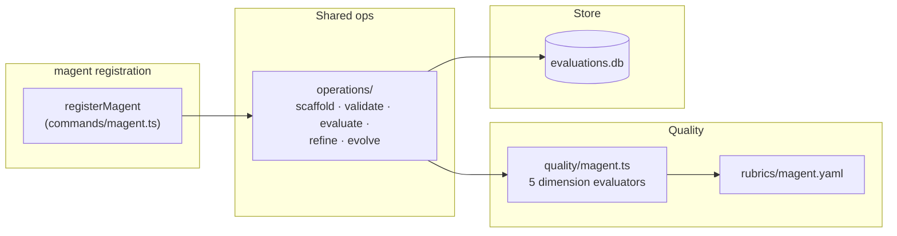

# `superskill magent`

Manage **main-agent** configuration files (`magent` = main-agent). These are the top-level agent config files (e.g. `CLAUDE.md`, `AGENTS.md`, `GEMINI.md`) that customize a coding agent's persona, routing rules, and platform behavior. A magent file has YAML frontmatter (`name`, `description`) and a body with routing, safety, and tone directives.

**Harness-aware (task 0080):** scaffolded and refined magents treat **spur** (task/feature/rule/workflow lifecycle) and **superskill** (skill/agent/command/hook/magent lifecycle + install) as the preferred tool surface when present. The canonical template ships a "Harness & Infrastructure" section; gold-master reference configs for major platforms live at `plugins/cc/skills/cc-magents/references/main-agents/`.

## How to use it

### Synopsis

```
superskill magent <operation> <name> [options]
```

The `magent` command exposes the five standard operations: `scaffold`, `validate`, `evaluate`, `refine`, `evolve`. The option tables are identical to those in [`cmd_agent.md`](cmd_agent.md#how-to-use-it).

### Required frontmatter

`name`, `description`.

### Quality dimensions

| Dimension | Weight | What it measures |
|-----------|--------|------------------|
| `completeness` | 0.25 | Does the config cover its stated scope end-to-end? Penalize missing routing rules, undocumented fallbacks, gaps between trigger and execution path. |
| `platform-coverage` | 0.25 | Does the config address all platforms it claims to support? Penalize platforms listed without rules, rules referencing capabilities a platform lacks. |
| `conciseness` | 0.15 | As short as possible while complete? Penalize redundant rule restating, boilerplate, mergeable rules. |
| `tone-consistency` | 0.20 | Is the tone consistent across the config? Penalize mixed registers, inconsistent person, persona drift between sections. |
| `safety` | 0.15 | Does the config avoid dangerous defaults? Penalize blanket permissions, disabled safety gates, unguarded destructive actions. |

### Examples

```bash
# Create a main-agent config from template
superskill magent scaffold claude-config \
  --description "Claude Code main-agent: routing, safety, persona"

# Validate against target platform
superskill magent validate claude-config --target claude --strict

# Score and persist
superskill magent evaluate claude-config --save

# Refine interactively
superskill magent refine claude-config

# Evolve from evaluation history
superskill magent evolve claude-config --propose-only --json
```

## How it's implemented

The `magent` command follows the shared type-command architecture documented in [`cmd_agent.md`](cmd_agent.md#how-its-implemented): `commands/magent.ts` registers five Commander subcommands that delegate to the shared operation modules (`operations/scaffold.ts`, `validate.ts`, `evaluate.ts`, `refine.ts`, `evolve.ts`). The command architecture diagram, quality lifecycle sequence, ER diagram, and double-loop gate flow are identical to the `agent` command.

### Type-specific wiring



The only differences from `agent` are:

1. **Quality evaluator** — `quality/magent.ts` implements the five magent-specific dimension scorers (`completeness`, `platform-coverage`, `conciseness`, `tone-consistency`, `safety`).
2. **Rubric** — `rubrics/magent.yaml` supplies the criteria, weights, and excellent/poor anchors. Note that magent weights `completeness` and `platform-coverage` highest (0.25 each), reflecting that main-agent configs must cover their stated platforms and scope completely.
3. **Required fields** — `REQUIRED_FIELDS.magent = ['name', 'description']` (no `model`/`tools`/`event`).
4. **Template** — `templates/magent/` provides the magent-specific scaffold template.

### Key source files

| File | Role |
|------|------|
| `apps/cli/src/commands/magent.ts` | Commander registration + thin handlers |
| `apps/cli/src/quality/magent.ts` | Magent-specific dimension evaluators |
| `apps/cli/src/rubrics/magent.yaml` | Rubric criteria + weights + anchors |
| `apps/cli/src/templates/magent/` | Default magent template |

The shared modules (`operations/*.ts`, `commands/helpers.ts`, `quality/dimensions.ts`, `store/*`) are documented in [`cmd_agent.md`](cmd_agent.md#key-source-files).
