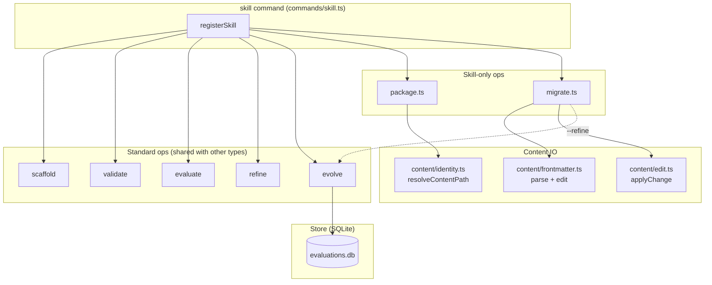
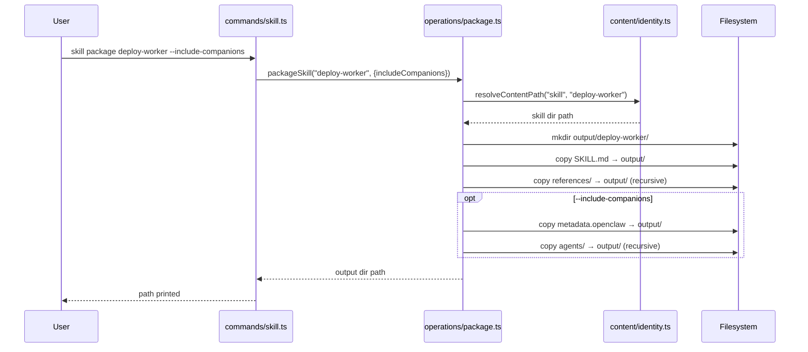

# `superskill skill`

Manage **skill** definitions — markdown files with YAML frontmatter (`name`, `description`) and a body that teaches an agent how to perform a technique. Skills are the primary reusable knowledge unit distributed by superskill.

The `skill` command exposes the five standard operations (`scaffold`, `validate`, `evaluate`, `refine`, `evolve`) plus two skill-only operations: **`package`** and **`migrate`**.

## How to use it

### Synopsis

```
superskill skill <operation> <name> [options]
```

### Standard operations

The five standard operations (`scaffold`, `validate`, `evaluate`, `refine`, `evolve`) behave identically to the other type commands. See [`cmd_agent.md`](cmd_agent.md) for the shared option table and lifecycle. Skill-specific details:

**Required frontmatter:** `name`, `description`.

**Quality dimensions** (scored by `evaluate`):

| Dimension | Weight | What it measures |
|-----------|--------|------------------|
| `completeness` | 0.25 | Does the skill cover its stated purpose end-to-end? Penalize missing steps, undocumented preconditions, gaps between trigger and outcome. |
| `clarity` | 0.25 | Is the instruction unambiguous to a fresh agent? Penalize vague verbs (`handle`, `process`), undefined terms, instructions needing external context. |
| `trigger-accuracy` | 0.20 | Does the skill fire on the right inputs and not adjacent ones? Penalize triggers too broad or too narrow. |
| `anti-hallucination` | 0.15 | Does the skill prevent fabrication? Penalize instructions inviting guessing, missing verification gates, no source-grounding. |
| `conciseness` | 0.15 | As short as possible while complete? Penalize redundant restating, boilerplate, mergeable steps. |

```bash
# Create a skill from template
superskill skill scaffold deploy-worker \
  --description "Deploy a Cloudflare Worker via wrangler"

# Validate it
superskill skill validate deploy-worker --strict

# Score it (persist to SQLite for later evolve)
superskill skill evaluate deploy-worker --save

# Auto-fix low-risk findings
superskill skill refine deploy-worker --auto --save
```

### `package` — bundle a skill for distribution (skill-only)

```bash
superskill skill package <name> [options]
```

| Option | Description | Default |
|--------|-------------|---------|
| `-o, --output <dir>` | Output directory | CWD |
| `--include-companions` | Include `metadata.openclaw` and `agents/` | `false` |

Resolves the skill via `resolveContentPath`, then bundles `SKILL.md` + `references/` into `<output>/<skill-name>/`. With `--include-companions`, also copies the companion configs (`metadata.openclaw`, `agents/`).

```bash
superskill skill package deploy-worker --output ./dist --include-companions
# → ./dist/deploy-worker/SKILL.md
# → ./dist/deploy-worker/references/...
# → ./dist/deploy-worker/metadata.openclaw
# → ./dist/deploy-worker/agents/...
```

### `migrate` — merge skills into a destination (skill-only)

```bash
superskill skill migrate <sources...> [options]
```

| Option | Description | Default |
|--------|-------------|---------|
| `--refine` | Route through the generation seam (F023) for content refinement | `false` |
| `--ingest <file>` | Agent-authored proposal JSON (apply through the double-loop gate) | — |
| `-t, --target <agent>` | Target agent platform | `claude` |
| `--margin <n>` | Δ-margin gate threshold | `0.05` |

The last positional argument is the destination skill name. Sources are parsed (frontmatter + body), deduplicated, and merged:

- **Frontmatter** — merge fields, with `name` set to the destination name; arrays (e.g. `tools`) are unioned preserving first-occurrence order.
- **Body** — concatenate source bodies in order, then collapse exact-duplicate lines and consecutive blank lines.

With `--refine`, the merged result routes through the evolve generation seam (`--propose-only --json`) so an external agent can refine the merged content. With `--ingest`, the agent-authored proposal is applied through the double-loop gate.

```bash
# Merge three skills into one
superskill skill migrate ./old-a.md ./old-b.md ./old-c.md merged-skill

# Merge + refine via an external agent
superskill skill migrate ./old-a.md ./old-b.md merged --refine --json > proposal.json
# (agent authors rewrite)
superskill skill migrate ./old-a.md ./old-b.md merged --ingest agent-proposal.json
```

## How it's implemented

The `skill` command shares the type-command architecture described in [`cmd_agent.md`](cmd_agent.md#how-its-implemented): `commands/skill.ts` registers Commander subcommands that delegate to `operations/*.ts`, scoring against `quality/skill.ts` and persisting to the shared SQLite store. The ER diagram and lifecycle sequence are identical.

The two skill-only operations add their own modules:

### Package + migrate architecture



### Package sequence



### Migrate sequence

```mermaid
sequenceDiagram
    participant User
    participant Cmd as commands/skill.ts
    participant MG as operations/migrate.ts
    participant FM as content/frontmatter.ts
    participant EV as operations/evolve.ts
    participant DB as store/

    User->>Cmd: skill migrate a.md b.md merged --refine
    Cmd->>MG: migrateSkills([a,b], "merged", {refine})
    MG->>MG: loadSources([a,b]) → parse each
    MG->>MG: mergeFrontmatter (union arrays, set name=merged)
    MG->>MG: mergeBodies (concat + dedupeLines)
    MG->>MG: serializeSkill → write merged.md

    alt --refine (generation seam)
        MG->>EV: evolve("skill", "merged", {proposeOnly,json})
        EV->>DB: getEvaluations history
        EV-->>MG: generation envelope (briefs + trends)
        MG-->>User: JSON envelope to stdout
    else --ingest (apply agent proposal)
        MG->>EV: evolve("skill", "merged", {ingest, acceptId})
        EV->>EV: double-loop gate (validate + Δ-margin + anchor + skeptic)
        EV-->>MG: EvolveResult
        MG-->>User: applied/rejected
    else plain merge (no --refine/--ingest)
        MG-->>User: merged skill written
    end
```



### Key source files

| File | Role |
|------|------|
| `apps/cli/src/commands/skill.ts` | Commander registration (7 subcommands) + handlers |
| `apps/cli/src/operations/scaffold.ts` | Shared scaffold: template resolution + `<!-- VAR -->` substitution |
| `apps/cli/src/operations/validate.ts` | Shared validation: schema, types, format compliance, links |
| `apps/cli/src/operations/evaluate.ts` | Shared evaluate: heuristic + rubric + scorer seam |
| `apps/cli/src/operations/refine.ts` | Shared refine: classify → auto-apply → interactive review |
| `apps/cli/src/operations/evolve.ts` | Shared evolve: trends → generation seam → double-loop gate |
| `apps/cli/src/operations/package.ts` | **Skill-only**: bundle SKILL.md + references + companions |
| `apps/cli/src/operations/migrate.ts` | **Skill-only**: merge sources, optionally route through evolve |
| `apps/cli/src/quality/skill.ts` | Skill-specific dimension evaluators (completeness, clarity, trigger-accuracy, anti-hallucination, conciseness) |
| `apps/cli/src/rubrics/skill.yaml` | Rubric criteria + weights + anchors |
| `apps/cli/src/templates/skill/` | Default skill template |
