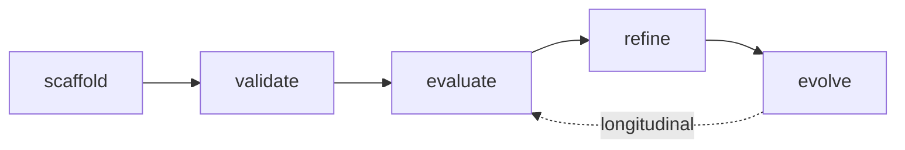

# superskill — Help

**superskill** is a CLI for distributing and authoring agent-facing content (skills, slash commands, subagents, hooks, main-agent configs) across multiple coding-agent platforms from a single Claude Code plugin source of truth.

## What it does

Two layers:

1. **Distribution** — `superskill install` takes a Claude Code plugin and distributes its skills, commands, subagents, hooks, and MCP config to any supported target agent (Claude Code, Codex, Pi, omp, OpenCode, Antigravity, Hermes, OpenClaw).
2. **Authoring + quality** — Five type commands (`agent`, `skill`, `command`, `hook`, `magent`) provide scaffold → validate → evaluate → refine → evolve workflows with persistent quality history in SQLite.

## Documentation map

### Getting started

| Document | Covers |
|----------|--------|
| [Installation](installation.md) | Prerequisites, install methods, binary on PATH, troubleshooting |
| [Quick start](quick_start.md) | Get a plugin installed + author your first skill in 5 minutes |

### Commands

| Document | Covers |
|----------|--------|
| [`install` command](cmd_install.md) | Distribute a plugin to target agents |
| [`agent` command](cmd_agent.md) | Manage subagent definitions |
| [`skill` command](cmd_skill.md) | Manage skill definitions (includes `package`, `migrate`) |
| [`command` command](cmd_command.md) | Manage slash command definitions |
| [`hook` command](cmd_hook.md) | Manage hook definitions (includes `emit`, `run`) |
| [`magent` command](cmd_magent.md) | Manage main-agent configurations |

### Reference

| Document | Covers |
|----------|--------|
| [Quality system](quality_system.md) | Rubrics, scoring dimensions, two-call seam, double-loop gate, empirical behavior gate |
| [Entity locations](entity_locations.md) | Where superskill writes each entity type per target agent |
| [Bundled `cc` plugin](bundled_plugin.md) | The shipped Claude Code plugin — entities, delegation pattern, scripts |
| [Plugin script organization](how_to_organize_scripts_for_plugin_development.md) | Dual contract: standard staged path (`script path`) + optional binary registry (`script run`/`hook run`), install staging, Entrypoint Contract, authoring anti-patterns |
| [Development guide](development.md) | Stack, workspace layout, build commands, verification gate, code style |

## Command overview

```
superskill
├── install <plugin>          # distribute a plugin to target agents
├── agent <op> <name>         # subagent definitions
├── skill <op> <name>         # skill definitions (+ package, migrate)
├── command <op> <name>       # slash command definitions
├── hook <op> <name>          # hook definitions (+ emit, run)
└── magent <op> <name>        # main-agent configs
```

The five type commands (`agent`, `skill`, `command`, `hook`, `magent`) share a common five-operation lifecycle:



- **scaffold** — create a new file from a type-specific template
- **validate** — structural + schema + format-compliance checks
- **evaluate** — score across type-specific quality dimensions (heuristic or rubric)
- **refine** — auto-fix low-risk findings, suggest the rest
- **evolve** — propose longitudinal improvements from evaluation history through a double-loop gate

Each operation is detailed in its command page, including usage, options, implementation architecture, and sequence diagrams.

## Supported targets

| Target | Engine | Output location |
|--------|--------|-----------------|
| `claude` | Direct `claude plugin install` | Claude Code marketplace |
| `codex` | rulesync | `~/.agents/skills/` |
| `pi` | rulesync + superskill hooks | Pi native format |
| `omp` | superskill copy (via `pi` surrogate) | `~/.omp/agent/skills/` |
| `opencode` | rulesync | `~/.agents/skills/` |
| `antigravity-cli` | rulesync | `~/.gemini/antigravity-cli/skills/` |
| `antigravity-ide` | rulesync | `~/.gemini/config/skills/` |
| `hermes` | superskill copy (via `opencode` surrogate) | `~/.hermes/skills/` |
| `openclaw` | implicit (reads `~/.agents/skills/`) | Shared skills root — no dedicated dispatch |

See [entity locations](entity_locations.md) for the full per-target directory table (global + project-level).

## Further reading

The authoritative project docs live in [`docs/`](../):

- [`00_ADR.md`](../00_ADR.md) — architecture decisions (binding)
- [`01_PRD.md`](../01_PRD.md) — product scope
- [`03_ARCHITECTURE.md`](../03_ARCHITECTURE.md) — module boundaries and data flow
- [`04_DESIGN.md`](../04_DESIGN.md) — CLI surface, flags, schemas
