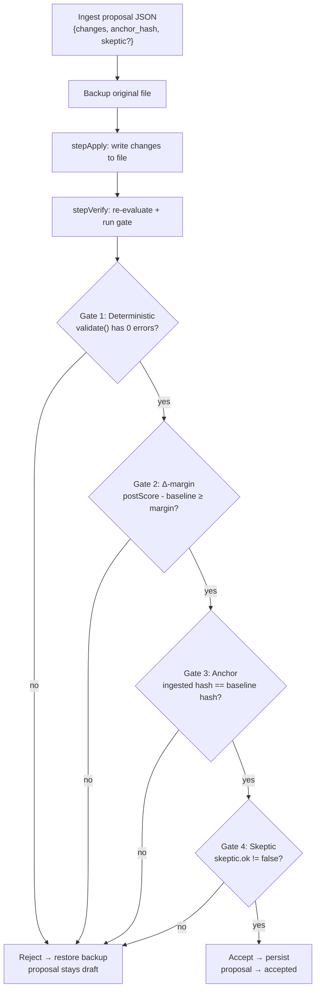
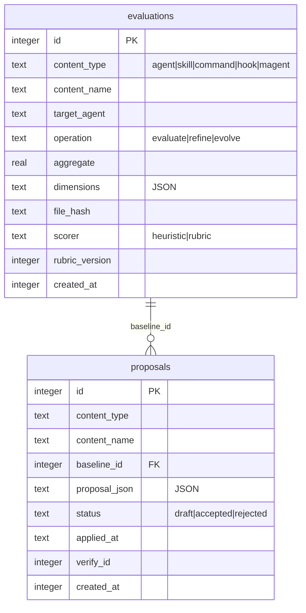

# Quality system

superskill scores agent-facing content (skills, commands, subagents, hooks, main-agent configs) across type-specific quality dimensions. The system never scores or generates inline — quality operations drive four personas via a two-call seam, and the CLI ingests results.

## Operation lifecycle

```
scaffold → validate → evaluate → refine → evolve
                ↑                       │
                └─── longitudinal ───────┘
```

| Operation | Purpose | Quality gate |
|-----------|---------|-------------|
| `scaffold` | Create new entity from template | Structure validation |
| `validate` | Check structure and frontmatter | Pre-check spur rules |
| `evaluate` | Score quality across dimensions | Rubric-weighted scoring (Scorer persona) |
| `refine` | Apply low-risk fixes automatically | Fix classification (auto-apply / suggest / flag) |
| `evolve` | Propose longitudinal improvements | Double-loop gate (Author → Skeptic → Judge) |

Extra operations by type:

| Type | Extra operation | What it does |
|------|----------------|-------------|
| `skill` | `package` | Bundle a skill + companion files into a distributable archive |
| `skill` | `migrate` | Merge one or more source skills into a destination skill |
| `hook` | `emit` | Emit a hook definition to a single target agent |

## Rubric-driven evaluation

`evaluate` scores entities across type-specific quality dimensions using YAML rubrics. Ships with 5 package-default rubrics (`agent`, `skill`, `command`, `hook`, `magent`) — load custom ones with `--rubric <path>`.

```bash
# Heuristic evaluation (built-in checks)
superskill skill evaluate my-skill --save

# Rubric evaluation — emit scoring brief for an external model
superskill skill evaluate my-skill --rubric --json > scoring-brief.json

# Ingest scored result and persist
superskill skill evaluate my-skill --ingest scored-result.json --save
```

### Quality dimensions by type

Each type is scored across five dimensions with type-specific weights. The aggregate score is a weighted mean (heuristic path) or rubric-weighted score (ingest path).

#### Agent

| Dimension | What it measures |
|-----------|------------------|
| `completeness` | Are all required subagent fields present and populated? |
| `role-clarity` | Is the role/name unambiguous and specific? |
| `tool-selection` | Are the declared tools appropriate for the role? |
| `skill-linkage` | Does the subagent reference relevant skills correctly? |
| `model-fit` | Is the model alias appropriate for the task complexity? |

#### Skill

| Dimension | Weight | What it measures |
|-----------|--------|------------------|
| `completeness` | 0.25 | Does the skill cover its stated purpose end-to-end? |
| `clarity` | 0.25 | Is the instruction unambiguous to a fresh agent? |
| `trigger-accuracy` | 0.20 | Does the skill fire on the right inputs and not adjacent ones? |
| `anti-hallucination` | 0.15 | Does the skill prevent fabrication? |
| `conciseness` | 0.15 | As short as possible while complete? |

#### Command

| Dimension | Weight | What it measures |
|-----------|--------|------------------|
| `completeness` | 0.25 | Does the command cover its function end-to-end? |
| `clarity` | 0.25 | Is the purpose and usage unambiguous? |
| `argument-hints` | 0.20 | Are argument hints present and accurate? |
| `tool-references` | 0.15 | Are tool references correct and reachable? |
| `slash-syntax` | 0.15 | Is the slash syntax correct and consistent? |

#### Hook

| Dimension | Weight | What it measures |
|-----------|--------|------------------|
| `correctness` | 0.30 | Does the hook's logic produce the intended effect? |
| `event-coverage` | 0.30 | Does the hook handle all events it claims to? |
| `safety` | 0.25 | Does the hook avoid destructive side effects? |
| `pattern-match-quality` | 0.15 | Are the matchers precise? |

#### Magent

| Dimension | Weight | What it measures |
|-----------|--------|------------------|
| `completeness` | 0.25 | Does the config cover its stated scope end-to-end? |
| `platform-coverage` | 0.25 | Does the config address all platforms it claims to support? |
| `tone-consistency` | 0.20 | Is the tone consistent across the config? |
| `conciseness` | 0.15 | As short as possible while complete? |
| `safety` | 0.15 | Does the config avoid dangerous defaults? |

## Two-call seam (Scorer / Author / Skeptic / Judge)

The CLI never scores or generates inline. Quality operations drive four personas via a two-call seam — the CLI emits envelopes, personas process offline, the CLI ingests results.

| Persona | Role | Input | Output |
|---------|------|-------|--------|
| **Scorer** | Rubric judge | Envelope from `evaluate --rubric --json` | `{ rubric_version, dimensions: { score, note } }` |
| **Author** | Rewriter | Envelope from `evolve --propose-only --json` | `ProposedChange[]` with `anchor_hash` |
| **Skeptic** | Refuter | Proposal + verbatim goal anchor | `{ ok, violations[] }` |
| **Judge** | Tournament selector | Multiple candidate proposals | Winning proposal ID |

## Double-loop gate for `evolve`

`evolve --ingest <file>` applies authored proposals through a four-gate quality control:

1. **Deterministic validate** — 0 errors required
2. **Δ-margin** — score must improve by ≥ `--margin` (default 0.05)
3. **Anchor hash** — goal anchor unchanged (hash-gated)
4. **Skeptic review** — regressive merges rejected and restored



The gates run in order; the first failure wins and names the gate in the rejection reason. On failure, the file is restored byte-identical from the backup and the proposal stays in `draft` status.

Version-aware trends partition by `rubric_version`, preventing false regression signals when rubrics are updated.

### Empirical behavior gate (`--eval-gate`)

When `--eval-gate` is set and a `skills/<name>/eval/cases.yaml` file exists, held-out eval cases are replayed against the candidate skill. The proposal is accepted only when the candidate strictly outperforms the baseline on the holdout set.

The gate is **additive** (layered on top of the form gate) and **skip-when-absent** — no `cases.yaml` → gate skipped, no flag → gate skipped.

**Phase 1** (ADR-018) uses deterministic checkable references only:
- `exact` — exact string match
- `rule` — `{ checks: [{ op: contains | regex | equals | not_contains | tool_called, arg: string }] }`

**Phase 2** (ADR-019) adds `rubric` reference kind for open-ended cases requiring LLM judgment:
- Candidate and baseline outputs are judged **pairwise** in a single call per measured case (not two independent absolute scores)
- Seed-controlled output ordering across judge replays
- **Noise-floor estimation** (N-replay signed-margin variance) ensures the gate rejects within-noise wins — the judge's non-determinism cannot be laundered as improvement
- Budget guard fails loud on cap

```yaml
# skills/<name>/eval/cases.yaml
version: 1
cases:
  - id: unique-case-id
    split: train | holdout
    prompt: "case prompt"
    reference_kind: exact | rule | rubric
    reference: "exact reference text"          # exact
    # reference: { checks: [...] }            # rule
    # reference: { criterion: "...", excellent?: "...", poor?: "..." }  # rubric
```

### Evolve flags

| Flag | Description | Default |
|------|-------------|---------|
| `--from <date>` | Analyze evaluations since ISO date | all history |
| `--propose-only` | Generate a proposal without applying | `false` |
| `--accept <id>` | Accept and apply a specific draft proposal | — |
| `--reject <id>` | Reject a specific draft proposal | — |
| `--json` | Machine-readable JSON (envelope-out with `--propose-only`) | `false` |
| `--ingest <file>` | Agent-authored proposal JSON (ingest-in mode) | — |
| `--margin <n>` | Δ-margin gate threshold | `0.05` |
| `--eval-gate` | Enable empirical behavior gate | `false` |
| `--analyze` | Print analysis summary (trends, score) without writing a proposal | `false` |
| `--history` | List applied proposal versions from the store | `false` |
| `--rollback <id>` | Rollback to a prior version by proposal_id (requires `--confirm`) | — |
| `--confirm` | Confirm a destructive operation (required for `--rollback`) | `false` |

> **Hook divergence:** `hook refine` is **suggest-only** (no `--auto`), and `hook evolve` is **analyze-only** (no `--history` / `--rollback` / `--confirm`). Hooks are security-critical JSON config — automated mutation is too dangerous.

## Data model

All five type commands share one SQLite database (`~/.superskill/evaluations.db`) with two tables:



- **`evaluations`** is append-only — every `evaluate --save` and `refine --save` inserts a row.
- **`proposals`** has a mutable lifecycle: `draft` → `accepted` | `rejected`.
