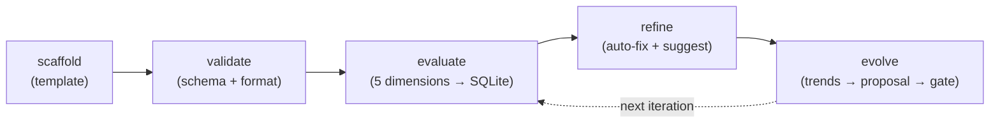

# Quick start

This guide gets you distributing a plugin and authoring your first skill in under five minutes.

## 1. Install superskill

```bash
npm i -g @gobing-ai/superskill
# or build from source — see installation.md
```

## 2. Distribute an existing plugin

If you have a Claude Code plugin (a directory with `plugin.json` and `skills/`, `commands/`, `agents/`, `hooks.json`, or `mcp.json`), install it to every supported target:

```bash
superskill install my-plugin --targets all
```

To preview without writing files:

```bash
superskill install my-plugin --targets codex,pi --dry-run --verbose
```

See [`cmd_install.md`](cmd_install.md) for the full pipeline, flags, and target dispatch logic.

## 3. Author a new skill

Create a skill from the built-in template:

```bash
superskill skill scaffold my-skill --description "Deploy a Cloudflare Worker"
```

This writes `./my-skill/SKILL.md` (or a path under `--output`) from `src/templates/skill/`, substituting `<!-- NAME -->`, `<!-- DESCRIPTION -->`, and `<!-- TARGET -->` placeholders.

Validate it:

```bash
superskill skill validate my-skill
```

Score it across the five skill quality dimensions (completeness, clarity, trigger-accuracy, anti-hallucination, conciseness):

```bash
superskill skill evaluate my-skill --save
```

`--save` persists the report to the SQLite store at `~/.superskill/evaluations.db` so later `evolve` runs can read the history.

Auto-fix low-risk findings:

```bash
superskill skill refine my-skill --auto
```

## 4. The quality lifecycle



Each `evaluate --save` and `refine --save` appends a row to the `evaluations` table. `evolve` reads that history, computes per-dimension trends, and emits a proposal. With the generation seam (`--propose-only --json` / `--ingest`), an external agent authors the rewrite and the double-loop gate decides whether to accept it.

See [`cmd_skill.md`](cmd_skill.md) for the full skill command surface, and each type command page for type-specific dimensions and extras.

## Next steps

- [Distribution: `install`](cmd_install.md)
- [Authoring: `agent` / `skill` / `command` / `hook` / `magent`](index.md#documentation-map)
- [Architecture decisions](../00_ADR.md)
