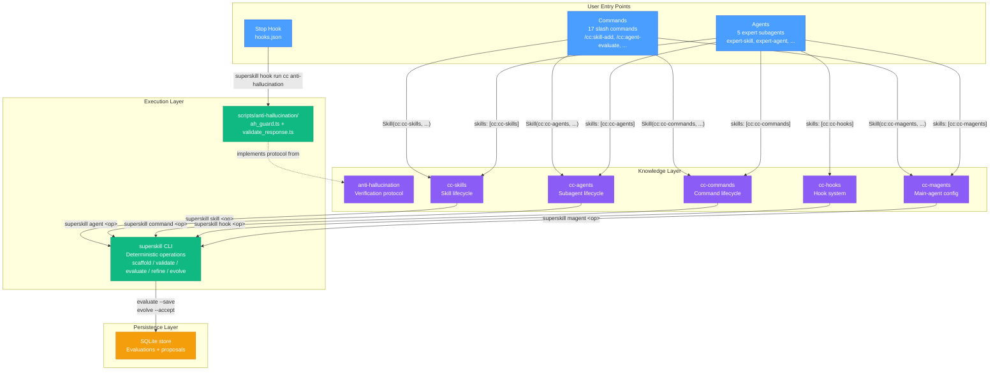

# Plugin `cc`

> **superskill** — a manager for multi-agent skill, slash command, subagent, hook, MCP, and main-agent config.

The `cc` plugin is the canonical Claude Code plugin for the superskill ecosystem. It provides a full lifecycle toolkit (scaffold → validate → evaluate → refine → evolve) for every entity type superskill manages — skills, slash commands, subagents, hooks, and main-agent configs — and ships an anti-hallucination guard that enforces verification-before-generation at the `Stop` hook.

- **Marketplace entry:** `name: "cc"`, `version: "0.3.0"`, `source: "./plugins/cc"` (`.claude-plugin/marketplace.json`)
- **CLI floor:** hooks run via `superskill hook run cc anti-hallucination`; the canonical `hooks.json` declares `minCliVersion: "0.2.19"`. Older CLIs fail open (skip hook emission rather than install broken guards).
- **Owner:** Robin Min
</input>

## Directory Layout

```
plugins/cc/
├── skills/                          # Domain knowledge + workflow documentation (6 skills)
│   ├── anti-hallucination/          # Zero-trust verification protocol (v3.0.0)
│   ├── cc-agents/                   # Subagent lifecycle (v3.0.0, 6 platforms)
│   ├── cc-commands/                 # Slash command lifecycle (v3.0.0, 6 platforms)
│   ├── cc-hooks/                    # Multi-agent hook system (v3.0.0, 6 platforms)
│   ├── cc-magents/                  # Main-agent config (v5.0.0, 15 platforms)
├── commands/                        # Slash command definitions (17)
├── agents/                          # Expert subagent definitions (5)
├── hooks/                           # Hook definitions
│   └── hooks.json
├── scripts/                         # Executable TypeScript (hook enforcement)
│   └── anti-hallucination/
│       ├── ah_guard.ts              # Core guard engine
│       ├── validate_response.ts     # CLI entry point
│       ├── logger.ts                # Self-contained logger
│       └── tests/                   # Unit tests
└── README.md                        # This file
```

## Entity Design Purposes

### 1. Skills (`skills/`)

**Purpose:** The single source of truth for domain knowledge and workflow documentation. Each skill is a self-contained knowledge module that teaches the agent how to perform a specialized task.

| Skill | Version | Platforms | Domain |
|-------|---------|-----------|--------|
| `anti-hallucination` | 3.0.0 | claude-code, codex, antigravity, opencode, openclaw | Zero-trust verification protocol — enforces source citations, confidence scoring, and tool-usage evidence before factual claims |
| `cc-agents` | 3.0.0 | claude-code, gemini-cli, opencode, codex, openclaw, antigravity | Subagent lifecycle — scaffold / validate / evaluate / refine / evolve subagent definitions across 6 platforms |
| `cc-commands` | 3.0.0 | claude-code, codex, gemini, openclaw, opencode, antigravity | Slash command lifecycle — scaffold / validate / evaluate / refine / evolve slash commands across platforms |
| `cc-hooks` | 3.0.0 | claude-code, codex, opencode, pi, openclaw, gemini | Multi-agent hook system — author hooks once in rulesync-canonical `hooks.json` (`HookDefinitionSchema`), deploy to 5+ agents |
| `cc-magents` | 5.0.0 | 15 platforms (agents-md, codex, claude-code, gemini-cli, opencode, cursor, copilot, windsurf, cline, zed, amp, aider, openclaw, antigravity, pi) | Main-agent config — manage `AGENTS.md`, `CLAUDE.md`, `GEMINI.md`, `.cursor/rules`, etc. (not subagents) |
| `cc-skills` | 3.0.0 | claude-code, codex, antigravity, opencode, openclaw | Skill lifecycle — scaffold / validate / evaluate / refine / evolve agent skills across platforms |

Each skill directory contains:

- `SKILL.md` — Main documentation with YAML frontmatter (`name`, `description`, `metadata.version`, `metadata.platforms`, `metadata.interactions`, etc.)
- `references/` — Deep-dive docs (workflows, platform-compatibility, evaluation-frameworks, red-flags, troubleshooting)
- `agents/openai.yaml` — Codex/OpenAI platform-specific agent config
- `metadata.openclaw` — OpenClaw platform metadata

The `cc-hooks` skill additionally ships an `examples/` directory with ready-to-use shell hook scripts (`load-context.sh`, `validate-bash.sh`, `validate-write.sh`).

**Design principle:** Skills are **knowledge, not execution**. They describe what to do and why; the `superskill` CLI performs deterministic execution.

### 2. Commands (`commands/`)

**Purpose:** Thin slash-command wrappers that parse user arguments and delegate to the corresponding skill. Each command is a user-facing entry point that bridges natural language to skill invocation.

There are **17 commands** — four lifecycle operations × four entity types, plus dedicated `hook-evaluate` (hooks are security-critical JSON; scaffold/refine/evolve are handled differently — see design doc):

| Operation | Agent | Command | Magent | Skill | Hook |
|-----------|-------|---------|--------|-------|------|
| **add** (scaffold) | `/cc:agent-add` | `/cc:command-add` | `/cc:magent-add` | `/cc:skill-add` | — |
| **evaluate** | `/cc:agent-evaluate` | `/cc:command-evaluate` | `/cc:magent-evaluate` | `/cc:skill-evaluate` | `/cc:hook-evaluate` |
| **refine** | `/cc:agent-refine` | `/cc:command-refine` | `/cc:magent-refine` | `/cc:skill-refine` | — |
| **evolve** | `/cc:agent-evolve` | `/cc:command-evolve` | `/cc:magent-evolve` | `/cc:skill-evolve` | — |
Each command file contains:
- YAML frontmatter (`description`, `argument-hint`, `allowed-tools`)
- A delegation block: `Skill(skill="cc:cc-XXX", args="<op> $ARGUMENTS")`
- A CLI fallback: `superskill <type> <op> $ARGUMENTS` (for non-Claude platforms)

**Design principle:** Commands are **pass-through routers**. They contain zero domain logic — they parse `$ARGUMENTS` and forward to the skill, which forwards to the CLI.

**Install-time adaptation:** For non-Claude targets, `superskill install` adapts each command `.md` file into a Skills 2.0 skill directory entry via `pipeline/adapt-command.ts`. The adaptation injects `name` and `disable-model-invocation: true` frontmatter — the command becomes a non-invocable skill entry that preserves its delegation instructions verbatim in the body.

### 3. Agents (`agents/`)

**Purpose:** Thin specialist subagents that route requests to the correct skill operation. Unlike general-purpose subagents, these are tightly scoped: each expert agent owns exactly one entity type.

| Agent | Delegates To | Color | Trigger Examples |
|-------|-------------|-------|------------------|
| `expert-agent` | `cc:cc-agents` | azure | "create an agent", "evaluate agent", "refine agent" |
| `expert-command` | `cc:cc-commands` | gold | "create a command", "validate command" |
| `expert-hook` | `cc:cc-hooks` | crimson | "create hooks", "cross-platform hooks" |
| `expert-magent` | `cc:cc-magents` | teal | "create AGENTS.md", "score my main agent" |
| `expert-skill` | `cc:cc-skills` | teal | "create a skill", "scaffold a skill" |
</input>

Each agent has:
- `tools: [Read, Glob]` — minimal, read-only tool access
- `skills: [cc:cc-XXX]` — bound to exactly one skill
- `model: inherit` — inherits the parent session's model

#### Personas — the Phase 4 quality seam

The **evaluate** and **evolve** operations drive quality scoring via four personas. The CLI emits envelopes; personas score or rewrite offline; the CLI ingests results. The CLI never scores or generates inline.

| Persona | Role | Input | Output |
|---------|------|-------|--------|
| **Scorer** | Rubric judge — scores each dimension against the criterion | Envelope JSON from `evaluate --rubric --json` | `{ rubric_version, dimensions: { name: { score, note } } }` |
| **Author** | Rewriter — rewrites content per dimension from generation briefs | Envelope JSON from `evolve --propose-only --json` | `ProposedChange[]` with real `proposed` text + `anchor_hash` |
| **Skeptic** | Refuter — checks proposal against verbatim goal anchor for violations/omissions | Proposal + verbatim original instructions + negative constraints | `{ ok, violations[] }` |
| **Judge** | Tournament selector — pairwise comparison when multiple candidates exist | Multiple candidate proposals + verbatim goal anchor | Winning proposal ID |

**Goal-anchor verbatim discipline:** Persona prompts MUST pass the original instructions + negative constraints **verbatim** to Skeptic/Judge. No compaction, no summarization, no paraphrasing. The CLI gate (F024) enforces via `anchor_hash` — if the agent strips or alters the anchor, the hash won't match and the gate rejects.

**Design principle:** Expert agents are **delegates, not implementors**. They never contain domain logic. Their sole job is to recognize trigger phrases and route to the bound skill, which routes to the CLI. This separation means all knowledge lives in skills, all execution lives in the CLI, and agents are just dispatchers.

**Install-time adaptation:** For non-Claude targets, `superskill install` adapts each agent `.md` file into a Skills 2.0 skill directory entry via `pipeline/adapt-subagent.ts`. Unlike commands, agents remain model-invocable (`disable-model-invocation` is NOT set) — the adaptation preserves `description`, `tools`, `model`, `skills`, `color`, and all trigger examples. Pi additionally receives a native agent frontmatter format via `pipeline/pi-subagent.ts`.

### 4. Hooks (`hooks/`)

**Purpose:** Event-driven enforcement that runs automatically without user invocation. The `hooks.json` file registers hook handlers for Claude Code lifecycle events.

Currently registered:

| Event | Matcher | Handler | Timeout |
|-------|---------|---------|---------|
| `Stop` | `*` (all responses) | `superskill hook run cc anti-hallucination` | 10s |

The installed `hooks.json` invokes a **portable PATH command** (`superskill hook run cc anti-hallucination`) rather than a plugin-root script path (`${CLAUDE_PLUGIN_ROOT}/scripts/...`) or a Claude-only reference. The command resolves on every target with `superskill` on PATH; the dispatcher (`apps/cli/src/commands/hook-run.ts`) routes `cc/anti-hallucination` to the guard engine in `scripts/anti-hallucination/ah_guard.ts`. Targets without `superskill` on PATH fail open (treat the hook as allow).

The `Stop` hook fires when the agent is about to stop and checks whether the response satisfies the anti-hallucination protocol (source citations, confidence levels, tool-usage evidence). If the protocol is not satisfied, the hook denies the stop and requests corrections.

### 5. Scripts (`scripts/`)

**Purpose:** Executable TypeScript code that implements hook enforcement logic. Scripts are the runtime layer — they run as processes, not as LLM context.

| Script | Role |
|--------|------|
| `ah_guard.ts` | Core guard engine — resolves the `Stop` payload from stdin (Claude Code `transcript_path` + `stop_hook_active` loop guard, or omp `agent_end` `messages`) with `ARGUMENTS` env as the legacy/test channel, verifies citations/confidence/tool-usage patterns, exits 0 (allow) or 2 (deny; reason on stderr + canonical block JSON on stdout) |
| `validate_response.ts` | Standalone validation CLI (NOT a hook adapter — never wire into hooks.json) — reads response text from `RESPONSE_TEXT` env or stdin, runs `validateResponseText()`, exits 0 (protocol followed) / 1 (violation). Hook enforcement uses `superskill hook run cc anti-hallucination` with exit 2 = block |
| `logger.ts` | Self-contained minimal logger (migrated verbatim from Spur, task 0041) — avoids depending on host plugin's shared logger |
| `tests/ah_guard.test.ts` | Unit tests for the guard engine |
| `tests/validate_response.test.ts` | Unit tests for the CLI entry point |

The guard checks for:
- Source citation patterns (`[Source: ...]`, `Source: ...`, `Sources:` lists, HTTP/HTTPS URLs, markdown bold `**Source**:`)
- Confidence level indicators (`Confidence: HIGH|MEDIUM|LOW`, `### Confidence`)
- Evidence of verification tool usage (`ref_search_documentation`, `ref_read_url`, `searchCode`, `WebSearch`, `WebFetch`, MCP-prefixed variants)
- Unverified factual claims

**Design principle:** Scripts are **deterministic enforcement**. Unlike skills (which are advisory knowledge consumed by the LLM), scripts run as code and make binary allow/deny decisions. They are the hard gate that the soft skill cannot enforce on its own.

## Relationship Diagram



## Delegation Flow

The plugin follows a strict **three-tier delegation** pattern — each tier has a single responsibility and delegates to the next:

```
Tier 1 — Entry Points (Commands / Agents / Hooks)
  │   Parse user input, route to the correct skill
  │   Contains ZERO domain logic
  ▼
Tier 2 — Knowledge Layer (Skills)
  │   Provide domain knowledge, workflows, and patterns
  │   Delegate deterministic operations to the CLI
  │   Contains ZERO executable logic
  ▼
Tier 3 — Execution Layer (superskill CLI + Scripts)
  │   Perform deterministic operations (scaffold, validate, evaluate, etc.)
  │   Persist results to SQLite (evaluations, proposals)
  │   Enforce hard gates (hook scripts)
```

### Example: Creating a Skill

1. User types `/cc:skill-add my-skill --description "Wraps the foo API"`
2. **Command** (`skill-add.md`) parses `$ARGUMENTS` and calls `Skill(skill="cc:cc-skills", args="scaffold $ARGUMENTS")`
3. **Skill** (`cc-skills/SKILL.md`) provides the scaffold workflow documentation; the agent follows the skill to run `superskill skill scaffold my-skill --description "Wraps the foo API"`
4. **CLI** executes the scaffold operation, creates the directory structure, writes SKILL.md from template
5. Result: new skill directory on disk

### Example: Anti-Hallucination Enforcement

1. Claude Code prepares to stop after generating a response
2. **Stop Hook** (`hooks.json`) fires, invoking `superskill hook run cc anti-hallucination`
3. **Dispatcher** (`hook-run.ts`) routes `cc/anti-hallucination` to the guard engine; `resolveStopContext` reads the `Stop` payload from stdin (Claude Code sends `transcript_path` — the last textual assistant message is read from the transcript JSONL; omp forwards its `agent_end` event with `messages`; the `ARGUMENTS` env var remains the legacy/test channel), then checks citations, confidence levels, and tool-usage evidence
4. If protocol satisfied → exit 0 (allow stop)
5. If protocol violated → exit 2 with the reason on stderr (the universal block signal — Claude Code treats exit 1 as non-blocking) plus canonical `decision:"block"` JSON on stdout
6. The **`anti-hallucination` skill** provides the knowledge the agent uses to satisfy the guard on retry

### Example: Quality Evaluation via Personas

1. User types `/cc:skill-evaluate my-skill --save`
2. **Command** delegates to `cc:cc-skills` skill → `superskill skill evaluate my-skill --rubric --json`
3. **CLI** emits an envelope JSON with the skill content and rubric dimensions
4. **Scorer** persona scores each dimension, returns `{ rubric_version, dimensions: { ... } }`
5. CLI ingests scores, persists to SQLite via `--save`
6. For **evolve**: **Author** proposes changes → **Skeptic** checks against verbatim goal anchor (hash-gated) → **Judge** selects winner if multiple candidates

## Platform Compatibility

The `cc` plugin is the Claude Code native format. On other platforms (Codex, Gemini, Pi, OpenCode, Antigravity, Hermes, omp), the `superskill install` command maps plugin entities to platform-native locations via the rulesync mapper. OpenClaw is implicitly supported — it reads skills from `~/.agents/skills/`, the same root codex/opencode use in global mode.

| Plugin Entity | Claude Code | Other Platforms |
|--------------|-------------|-----------------|
| `skills/*.md` | `~/.claude/skills/` | Adapted as Skills 2.0 skill directories — all platforms receive skills uniformly |
| `commands/*.md` | `~/.claude/commands/` | Adapted as Skills 2.0 skill entries (`disable-model-invocation: true`) via `pipeline/adapt-command.ts` |
| `agents/*.md` | `~/.claude/agents/` | Adapted as Skills 2.0 skill entries (model-invocable) via `pipeline/adapt-subagent.ts`; Pi additionally gets native agent format via `pipeline/pi-subagent.ts` |
| `hooks/hooks.json` | `~/.claude/hooks/` | Routed in a separate `hooks`-only pass through `TARGET_TO_RULESYNC_HOOKS` so Antigravity reaches its native generator (`.agents/hooks.json` project / `.gemini/config/hooks.json` global). Pi/omp get the pi-hooks shim; Hermes gets `hooks.json` copied verbatim. Hook commands resolve to `superskill hook run …` (PATH), not plugin-root scripts |
| `scripts/` | `${CLAUDE_PLUGIN_ROOT}/scripts/` | Invoked via the `superskill hook run` dispatcher at runtime — scripts are no longer referenced by installed hook configs directly |
Each skill declares its own platform support in `metadata.platforms` frontmatter — not all skills support all platforms. See the per-skill table above.

## Lifecycle Operations

All entity types share the same five-operation lifecycle, managed by the `superskill` CLI:

| Operation | Purpose | Quality Gate |
|-----------|---------|-------------|
| **scaffold** | Create new entity from template | Structure validation |
| **validate** | Check structure and frontmatter | Pre-check spur rules |
| **evaluate** | Score quality across dimensions | Rubric-weighted scoring (Scorer persona) |
| **refine** | Apply low-risk fixes automatically | Fix classification (auto-apply / suggest / flag) |
| **evolve** | Propose and apply longitudinal improvements | Double-loop gate (Author → Skeptic → Judge) |

## Which Operation When — the Flow Map

The lifecycle flow every entity follows is **add → validate → evaluate → refine → evolve**.
`validate` has no slash command of its own — it runs inside add/refine and directly via
`superskill <type> validate`. Every `plugins/cc/commands/*.md` appears exactly once in this table
(structural-test enforced):

| Entity | Create | Score | Fix now | Long-term |
|--------|--------|-------|---------|-----------|
| Skill | `/cc:skill-add` | `/cc:skill-evaluate` | `/cc:skill-refine` | `/cc:skill-evolve` |
| Subagent | `/cc:agent-add` | `/cc:agent-evaluate` | `/cc:agent-refine` | `/cc:agent-evolve` |
| Command | `/cc:command-add` | `/cc:command-evaluate` | `/cc:command-refine` | `/cc:command-evolve` |
| Magent | `/cc:magent-add` | `/cc:magent-evaluate` | `/cc:magent-refine` | `/cc:magent-evolve` |
| Hook | hand-authored (`hooks.json`) | `/cc:hook-evaluate` | — | — |

**Picking the operation:**

- **New artifact** → the entity's *Create* command (grill-style discovery interview first).
- **"How good is it?"** → *Score* — reads and reports; never writes.
- **"Fix it now"** → *Fix now* — evaluate + deterministic fixes + content fix types (description
  prune, pruning pass) in one step.
- **"It keeps drifting across sessions"** → *Long-term* — trend analysis over saved evaluations,
  failure-mode-tagged proposals, double-loop gated apply, rollback.

**Expert subagent routing:** `cc:expert-skill`, `cc:expert-agent`, `cc:expert-command`,
`cc:expert-magent`, and `cc:expert-hook` each wrap their entity's full lifecycle. Delegate to one
when the work spans several operations or deserves its own context window; invoke a single command
when you just need one step.

**Heuristic mode vs the two-call LLM seam:** heuristic mode (deterministic scorers, no LLM call)
is the default for evaluate/refine and the only mode CI gates use. The two-call seam
(envelope-out → agent judgment → ingest-in) is for genuinely subjective criteria and evolve
proposals. The dividing rule: deterministic proxies live in `quality/<type>.ts`, judgment criteria
live in rubric YAML.

**Session-crossing:** run evaluate with `--save` routinely — evolve's trend analysis reads that
history, and without it `--propose-only` has no drift signal to work from.

## Hook Runtime — `superskill hook run`

Installed hook configs invoke a stable PATH command instead of a plugin-checkout script path:

```
superskill hook run <plugin> <hook-id>
```

The dispatcher (`apps/cli/src/commands/hook-run.ts`) resolves a runner from the `HOOK_RUNNERS` registry by `<plugin>/<hook-id>`, hands it stdin + the process env, writes the runner's Claude-canonical hook JSON to stdout, and exits with the runner's code. Unknown `<plugin>/<hook-id>` is treated as **plugin/CLI version skew** (the installed plugin emits a hook this CLI doesn't know yet) — the dispatcher logs a warning naming the installed CLI version and the known-hook list, then exits 0 to fail open. Version skew must not turn into blocked Stops and agent loops.

Registered runners:

| Runner | Event | Behavior |
|--------|-------|----------|
| `sp/task-write-guard` | `PreToolUse` | Denies raw `Write`/`Edit` on paths owned by the Spur task corpus; ownership is delegated to `spur task resolve --strict`'s exit code. Fails open on every other condition; `SPUR_WRITE_GUARD=off` short-circuits to allow. |
| `sp/context-post-tool` | `PostToolUse` | Appends a token-budget event to the per-session ledger so `sp/context-session-stop` can roll up at session end. Fails open; never blocks. |
| `sp/context-session-start` | `SessionStart` | Initializes a per-session ledger file at `.spur/context/token-ledger.jsonl` and stamps the session id. Fails open. |
| `sp/context-session-stop` | `SessionStop` | Reads the ledger written by `sp/context-post-tool`, sums reads/writes/tokens for the session, emits a final `session_end` event, and clears the session file. Fails open. |
| `cc/anti-hallucination` | `Stop` | Blocks stop when the last assistant message claims external facts without source citations / confidence / verification-tool evidence. Reuses `resolveStopContext` + `verifyAntiHallucinationProtocol` from `ah_guard.ts`; honors Claude's `stop_hook_active` block-loop guard. Fails open (allow stop) on empty/invalid payloads. |

This is the cross-agent default for non-trivial command hooks: author the hook as a registered runner and invoke the PATH command, never a `${CLAUDE_PLUGIN_ROOT}/<script>` reference (the latter resolves on Claude Code only and silently fails everywhere else). See the `cc-hooks` skill for the full authoring guidance.
</input>
